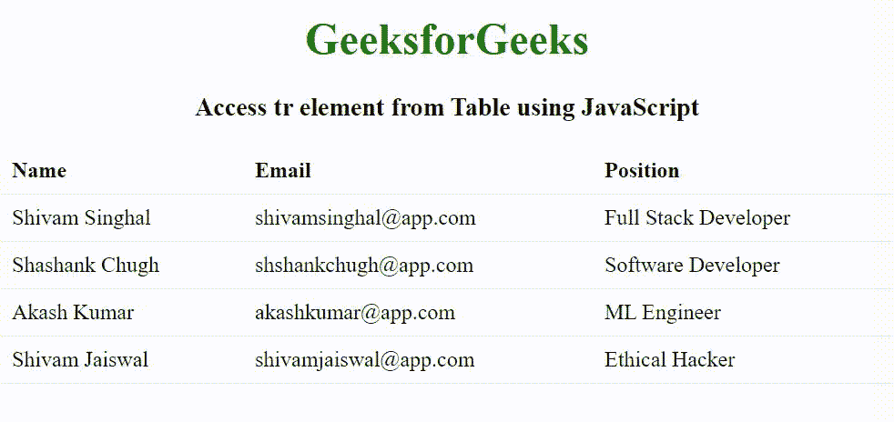

# 如何使用 JavaScript 从表格中访问元素？

> 原文: [https://www .极客们。org/how-access-tr-element-from-table-use-JavaScript/](https://www.geeksforgeeks.org/how-to-access-tr-element-from-table-using-javascript/)

给定一个 HTML 表，任务是从 Controller 中访问表元素，并突出显示我们想要的任何行。

**方法:**我们将在 JavaScript 中使用一个基本的 DOM 操作来访问表行元素。我们将添加高亮类到我们点击的行，如果高亮类已经存在，那么我们将删除这个类使它正常。

*   **[getelementbyid () method:](https://www.geeksforgeeks.org/html-dom-getelementbyid-method/)** To select it from the Id of any element in HTML, we will select the table to perform the above operation.
*   **[Add an event listener () Method:](https://www.geeksforgeeks.org/html-dom-addeventlistener-method/)** After selecting this table, we will add an event listener to listen to click events.
*   **Path:** When we click any point on the window, the path describes the complete path to which it belongs. For example, if we click on the td element of a table, its path will be [td, tr, tbody, table, body, html, document, window].
*   After the line is selected, we will look for the highlighted class in its classList. If it is found, we will simply delete this class, and if it is not included, we will add it.

**例:**

```html
<!DOCTYPE html>
<html>

<head>
    <title>
        How to Access tr element from
        Table using JavaScript ?
    </title>

    <style type="text/css">
        body {
            text-align: center;
        }

        h1 {
            color: green;
        }

        /* Basic CSS to design table */
        table {
            border-collapse: collapse;
            width: 100%;
        }

        th,
        td {
            padding: 8px;
            text-align: left;
            border-bottom: 1px solid #ddd;
        }

        /* CSS command for the row to highlight */
        .highlight {
            background-color: #b8b8b8;
        }
    </style>
</head>

<body>
    <h1>GeeksforGeeks</h1>

    <h3>
        Access tr element from
        Table using JavaScript
    </h3>

    <table id="table_to_highlight">
        <tr>
            <th>Name</th>
            <th>Email</th>
            <th>Position</th>
        </tr>
        <tr>
            <td>Shivam Singhal</td>
            <td>shivamsinghal@app.com</td>
            <td>Full Stack Developer</td>
        </tr>
        <tr>
            <td>Shashank Chugh</td>
            <td>shshankchugh@app.com</td>
            <td>Software Developer</td>
        </tr>
        <tr>
            <td>Akash Kumar</td>
            <td>akashkumar@app.com</td>
            <td>ML Engineer</td>
        </tr>
        <tr>
            <td>Shivam Jaiswal</td>
            <td>shivamjaiswal@app.com</td>
            <td>Ethical Hacker</td>
        </tr>
    </table>

    <script type="text/javascript">

        // JavaScript Code to Highlight any
        // row in the given table.
        document.getElementById('table_to_highlight')
            .addEventListener('click', function (item) {

                // To get tr tag 
                // In the row where we click
                var row = item.path[1];

                var row_value = "";

                for (var j = 0; j < row.cells.length; j++) {

                    row_value += row.cells[j].innerHTML;
                    row_value += " | ";
                }

                alert(row_value);

                // Toggle the highlight
                if (row.classList.contains('highlight'))
                    row.classList.remove('highlight');
                else
                    row.classList.add('highlight');
            });
    </script>
</body>

</html>
```

**输出:**
