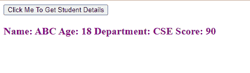
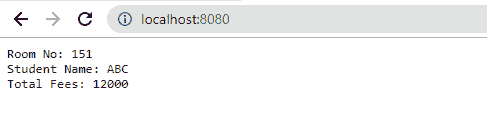

# 如何使用 JavaScript 从另一个文件访问变量？

> 原文:[https://www . geesforgeks . org/如何使用 javascript 从另一个文件访问变量/](https://www.geeksforgeeks.org/how-to-access-variables-from-another-file-using-javascript/)

在 JavaScript 中，可以使用

**第一种方法:**首先创建“ **module1.js** 文件，并定义属性为“姓名”、“年龄”、“部门”和“分数”的*学生*对象。 **module1.js** JavaScript 文件是使用 HTML 文件“头”部分内*脚本*标签的 *src* 属性导入的。由于导入了 JavaScript 文件，因此可以在 HTML 文件中访问内容。

我们创建了一个按钮，当点击它时会触发 JavaScript 函数。通过 **f()** 函数访问*学生*对象属性，所有*学生*对象属性都连接到一个字符串变量。使用 HTML DOM 的*document . getelementbyid()*和 *innerHTML* 属性，该字符串被放置在具有“text”id 的< p >标签中。这是一个客户端程序的例子。

**代码实现:**

**变量 _access.html**

## 超文本标记语言

```
<!DOCTYPE html>
<html>

<head>
    <script type="text/javascript" 
        src="module1.js">
    </script>
</head>

<body>
    <button onclick="f()">
        Click Me To Get Student Details
    </button>

    <div>
        <p id="text" style="color:purple; 
            font-weight:bold;font-size:20px;">
        </p>
    </div>

    <script type="text/javascript">
        function f() {
            var name = Student.name;
            var age = Student.age;
            var dept = Student.dept;
            var score = Student.score;

            var str = "Name:" + name + "\nAge: "
                + age + "\nDepartment:" + dept 
                + "\nScore: " + score;

            document.getElementById(
                'text').innerHTML = str;
        }
    </script>
</body>

</html>
```

**module1.js** 上述 HTML 代码中使用了该文件。

## java 描述语言

```
var Student =
{
    name : "ABC",
    age : 18,
    dept : "CSE",
    score : 90
};
```

**输出:**



**第二种方法:**在这种方法中，我们创建一个 JavaScript 文件“ **module1.js** ，并定义一个 *Student* 对象，该对象具有属性“姓名”、“年龄”、“部门”和“分数”。使用 module.exports 导出 *Student* 对象，在另一个 JavaScript 模块文件“ **module2.js** ”中，我们使用文件开头的 import 语句导入“ **module1.js** ”。对象*招待所*和*招待所 _ 分配*在“**模块 2.js** 文件中定义，*学生*对象在*招待所 _ 分配*对象中访问。

在端口 8080 创建并托管一个 HTTP 服务器。*招待所 _ 分配*的属性串联成一个字符串。每当 web 应用程序运行时，该字符串都会打印在登录页上。这是服务器端脚本的一个例子。

**代码实现:**

**module1.js**

## java 描述语言

```
var Student = {
    name : "ABC",
    age : 18,
    dept : "CSE",
    score : 90
};
module.exports = {Student};
```

**module2.js**

## java 描述语言

```
var http = require('http');
const {Student} = require('./module1.js');

var Hostel = {
    student_count: 500,
    no_of_rooms: 250,
    hostel_fees: 12000
}

var Hostel_Allocation = {
    room_no : 151,
    student_name: Student.name,
    student_age: Student.age,
    student_dept: Student.dept,
    total_fees: 12000
}

var str = "Room No: " + Hostel_Allocation.room_no
         + "\nStudent Name: "
         + Hostel_Allocation.student_name
         + "\nTotal Fees: "
         + Hostel_Allocation.total_fees;

http.createServer(function (req, res) {
    res.write(str); 
    res.end(); 
}).listen(8080);
```

**输出:**

**启动服务器**

```
node module2.js
```

在浏览器中运行应用程序

```
localhost:8080
```



JavaScript 最出名的是网页开发，但它也用于各种非浏览器环境。您可以通过以下 [JavaScript 教程](https://www.geeksforgeeks.org/javascript-tutorial/)和 [JavaScript 示例](https://www.geeksforgeeks.org/javascript-examples/)从头开始学习 JavaScript。