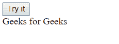
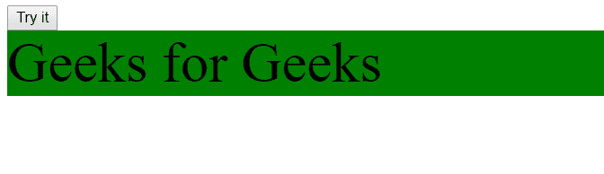
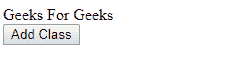
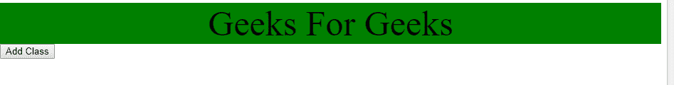

# 如何在 JavaScript 中给 DOM 元素添加一个类？

> 原文:[https://www . geesforgeks . org/如何将类添加到 javascript 中的 dom 元素/](https://www.geeksforgeeks.org/how-to-add-a-class-to-dom-element-in-javascript/)

**DOM** (文档对象模型)是一种操作文档(HTML 文档)的方式。本文将讨论如何访问和设置 DOM 元素的类名。在 DOM 中，所有的 HTML 元素都被定义为对象。我们将使用针对 CSS 的 Javascript 来操纵它们。
下面是 Javascript 的属性，我们将使用这些属性向 DOM 元素添加一个类:

*   **类列表属性:**它将类名作为一个 DOMTokenList 对象返回。它有一个叫“add”的方法，用来给元素添加类名。
    **语法:**

```
element.classList.add("className")
```

*   **示例:**

## 超文本标记语言

```
<!DOCTYPE html>
<html>

<head>
    <style>
        .geek {
            background-color: green;
            font-size: 50px;
        }
    </style>
</head>

<body>

    <button onclick="myClass()">Try it</button>

    <div id="gfg">Geeks for Geeks</div>

    <script>
        function myClass() {
            var elem = document.getElementById("gfg");

            // Adding class to div element
            elem.classList.add("geek");
        }
    </script>

</body>

</html>
```

**输出:**

*   **点击按钮前:**



*   **点击按钮后:**



*   **类名属性:**该属性返回元素的类名。如果元素已经有一个类，那么它将简单地添加另一个类，否则它将向它追加我们的新类。
    **语法:**

```
HTMLElementObject.className
```

*   **示例:**

## 超文本标记语言

```
                        <!DOCTYPE html>
<html>

<head>
    <style>
        .geekClass {
            background-color: green;
            text-align: center;
            font-size: 50px;
        }
    </style>
</head>

<body>

    <div id="gfg">
        Geeks For Geeks
    </div>

    <button onclick="myClassName()">Add Class</button>

    <script>
        function myClassName() {
            var element = document.getElementById("gfg");

            // Adding the class geekClass to element
            // with id gfg space is given in className
            // (" geekClass") as if there is already
            // a class attached to an element than our
            // new class won't overwrite and will append
            // one more class to the element
            element.className += " geekClass";
        }
    </script>

</body>

</html>
```

**输出:**

*   **点击按钮前:**



*   **点击按钮后:**



**支持的浏览器:**类别列表属性支持的浏览器如下:

*   Chrome 8+
*   Opera 11.5+
*   Safari 5.1+
*   Edge 10+
*   Mozilla Firefox 3.6+