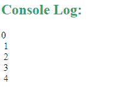

# 如何在 JavaScript 循环中增加延迟？

> 原文:[https://www . geesforgeks . org/如何在 javascript 循环中添加延迟/](https://www.geeksforgeeks.org/how-to-add-a-delay-in-a-javascript-loop/)

JavaScript 没有提供任何等待命令来增加循环的延迟，但是我们可以使用 **setTimeout** 方法来实现。此方法在等待指定的毫秒数后执行一个函数。下面给出的例子说明了如何给不同的循环增加延迟:

*   **For loop:**

    ```
    for (let i=0; i<10; i++) {
       task(i);
    }

    function task(i) {
      setTimeout(function() {
          // Add tasks to do
      }, 2000 * i);
    }
    ```

    在上面给出的代码中，您必须在第 8 行执行 **2000 * i** ，因为循环中的 **setTimeout** 方法不会使循环暂停，但实际上会增加每次迭代的延迟。记住，所有的迭代都是一起开始的。因此，如果我们只在那里做 **2000** ，这将使所有的迭代一起执行，它将在第一次迭代中给出 2000 毫秒的延迟，并且所有其他迭代将在之后立即发生。因此为了避免这种情况，我们把 0 加到第一，2000 加到第二，4000 加到第三，然后继续。

    **示例:**下面给定的程序将使用**进行**循环，对每个数字延迟 2 秒后，在控制台打印 0 到 9。

    ```
    <script>
    for (let i=0; i<10; i++) {
       task(i);
    }

    function task(i) {
      setTimeout(function() {
          console.log(i);
      }, 2000 * i);
    }
    </script>
    ```

    **输出:**
    

*   **While loop:** Same concept is applied to make below given while loop.

    ```
    let i = 0;
    while (i < 10) {
      task(i);
       i++;
    }
    function task(i) {
      setTimeout(function() {
          // Add tasks to do
      }, 2000 * i);
    }
    ```

    **示例:**下面给定的程序将在使用 while 循环对每个数字延迟 2 秒后，在控制台中打印 0 到 9。

    ```
    <script>
    let i = 0;
    while (i < 10) {
      task(i);
       i++;
    }
    function task(i) {
      setTimeout(function() {
          console.log(i);
      }, 2000 * i);
    }
    </script>
    ```

    **输出:**
    

*   **Do-while loop:** Same concept is applied to make below given do-while loop.

    ```
    let i = 0;
    do {
      task(i);
      i++;
    } while (i < 5);
    function task(i) {
      setTimeout(function() {
        // Add tasks to do
      }, 2000 * i);
    }
    ```

    **示例:**下面给定的程序将使用 do-while 循环对每个数字延迟 2 秒后在控制台中打印 0 到 9。

    ```
    <script>
    let i = 0;
    do {
      task(i);
      i++;
    } while (i < 5);
    function task(i) {
      setTimeout(function() {
        console.log(i);
      }, 2000 * i);
    }
    </script>
    ```

    **输出:**
    