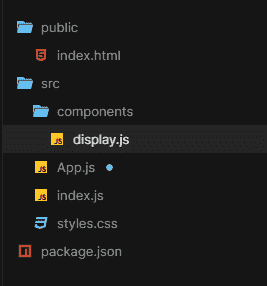

# 如何在 JSX 添加功能？

> 原文:[https://www.geeksforgeeks.org/how-to-add-a-function-in-jsx/](https://www.geeksforgeeks.org/how-to-add-a-function-in-jsx/)

[<u>React.js</u>](https://www.geeksforgeeks.org/reactjs-tutorials/) 使用了 [<u>的 JSX 扩展，JavaScript</u>](https://www.geeksforgeeks.org/javascript-tutorial/) 为我们编写应用程序提供了更简单的方式。功能是任何网络应用程序最重要的部分之一，使用它们，我们可以对用户界面进行优化计算和渲染，最终为我们提供一个完整构建的网站。在本文中，我们将讨论如何在 JSX 添加一个函数。

**创建反应应用程序并安装模块:**

*   **步骤 1:** 使用以下命令创建一个反应应用程序:

    ```
    npx create-react-app foldername
    ```

*   **步骤 2:** 创建项目文件夹(即文件夹名**)后，使用以下命令移动到该文件夹中:**

    ```
    cd foldername
    ```

*   **步骤 3:** 在您的系统上设置 react 环境后，我们可以从创建一个 *App.js* 文件开始，并创建一个名为*组件*的目录，我们将在其中编写我们想要的函数。

**项目结构:**如下图。



现在让我们看看如何用 JSX 添加一个函数。

**示例 1:** 在本例中，我们将考虑一个示例来演示如何将函数添加到我们的应用程序中。现在在组件目录中，我们将创建一个 *display.js* 文件，该文件将包含将要添加到应用程序中的显示功能。

## display.js

```
import React from "react";

// This is the function that will be added to the application
function Display() {
  return <h1>GeeksForGeeks</h1>;
}

export default Display;
```

现在，最后一步是将我们的功能合并到应用程序中。这可以通过将该函数导入 App.js 文件并使用该函数的名称作为自定义 JSX 标记来实现。

## App.js

```
import "./styles.css";
// Importing the function
import Display from "./components/display";

export default function App() {
  return (
    <div className="App">
      {/* Creating custom JSX tag to return the function */}
      <Display></Display>
    </div>
  );
}
```

**输出:**因此，我们可以看到，在我们的 JSX 代码中添加函数真的很简单。提供的示例非常简单，但是复杂的渲染和所需的计算也可以在函数内部完成，然后可以在我们的应用程序代码中使用。


**示例 2:** 现在，在这个示例中，我们将创建带有更改的 *display.js* 文件。这次我们可以从 *App.js* 文件中修改表头的内容。

## display.js

```
import React from "react";

// The contents of the header can 
// be modified in this function
function Display(props) {
  return <h1>{props.name}</h1>;
}

export default Display;
```

现在，我们现在将把函数合并到 App.js 文件中，就像我们在前面的例子中所做的那样。

## App.js

```
import "./styles.css";
// Importing the function
import Display from "./components/display.js";

export default function App() {
  return (
    <div className="App">
      {/*Customised JSX tag with different inputs*/}
      <Display name="Geeks"></Display>
      <Display name="For"></Display>
      <Display name="Geeks"></Display>
    </div>
  );
}
```

从代码中，我们可以预测现在的输出。请注意，您可以通过更改标签中的*名称*属性来渲染自定义输出。

**输出:**


**参考文献:**

*   [https://www . geesforgeks . org/reactjs-functional-components/](https://www.geeksforgeeks.org/reactjs-functional-components/)

*   [https://reactjs.org/docs/faq-functions.html](https://reactjs.org/docs/faq-functions.html)