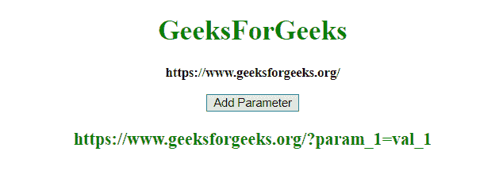

# 如何在 JavaScript 中给 URL 添加参数？

> 原文:[https://www . geeksforgeeks . org/如何向 javascript 中的 url 添加参数/](https://www.geeksforgeeks.org/how-to-add-a-parameter-to-the-url-in-javascript/)

给定一个 URL，任务是使用 JavaScript 向该 URL 添加一个附加参数(名称和值)。

**URL . search params:**URL 接口的这个只读属性返回一个 URLSearchParams 对象，该对象提供对 URL 中的 GET 解码查询参数的访问。

**语法:**

```
var URLSearchParams = URL.searchParams;
```

**示例 1:** 本示例使用**追加方法**添加参数。

```
<!DOCTYPE HTML> 
<html> 
    <head> 
        <title> 
            How to add a parameter to the URL
        </title>     
    </head> 

    <body style = "text-align:center;">

        <h1 style = "color:green;" > 
            GeeksForGeeks 
        </h1>

        <p id = "GFG_UP" style =
            "font-size: 15px; font-weight: bold;">
        </p>

        <button onclick = "GFG_Fun()">
            Add Parameter
        </button>

        <p id = "GFG_DOWN" style =
            "color:green; font-size: 20px; font-weight: bold;">
        </p>

        <script>
            var up = document.getElementById('GFG_UP');
            var url = new URL("https://www.geeksforgeeks.org");
            up.innerHTML = url;
            var down = document.getElementById('GFG_DOWN');

            function GFG_Fun() {
                url.searchParams.append('param_1', 'val_1');
                down.innerHTML = url;
            }
        </script> 
    </body> 
</html>                    
```

**输出:**

*   **点击按钮前:**
    
*   **点击按钮后:**
    

**示例 2:** 本示例使用**设置方法**添加参数。

```
<!DOCTYPE HTML> 
<html> 
    <head> 
        <title> 
            How to add a parameter to the URL
        </title>     
    </head> 

    <body style = "text-align:center;">

        <h1 style = "color:green;" > 
            GeeksForGeeks 
        </h1>

        <p id = "GFG_UP" style = 
            "font-size: 15px; font-weight: bold;">
        </p>

        <button onclick = "GFG_Fun()">
            Add Parameter
        </button>

        <p id = "GFG_DOWN" style =
            "color:green; font-size: 20px; font-weight: bold;">
        </p>

        <script>
            var up = document.getElementById('GFG_UP');
            var url = new URL("https://www.geeksforgeeks.org");
            up.innerHTML = url;
            var down = document.getElementById('GFG_DOWN');

            function GFG_Fun() {
                url.searchParams.set('param_1', 'val_1');
                down.innerHTML = url;
            }
        </script> 
    </body> 
</html>                    
```

**输出:**

*   **点击按钮前:**
    
*   **点击按钮后:**
    