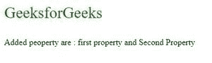

# 如何用变量作为名称给 JavaScript 对象添加属性？

> 原文:[https://www . geesforgeks . org/如何使用变量作为名称将属性添加到 javascript 对象/](https://www.geeksforgeeks.org/how-to-add-a-property-to-a-javascript-object-using-a-variable-as-the-name/)

我们可以用对象文字创建一个 JavaScript 对象:

**示例:**

```
 var obj = { firstname : "Romy", lastname : "kumari", age : 20}
```

名称:JavaScript 对象中的值对称为属性。我们可以通过使用点符号或括号符号，使用变量作为名称，将属性添加到 JavaScript 对象中。

以下示例说明了两种不同的方法:

**示例 1:** 在本例中，我们将使用点符号。

## 超文本标记语言

```
<!DOCTYPE html>
<html>
    <body>
        <p style="font-size: 30px; color: green;" ;>
          GeeksforGeeks
        </p>

        <p id="add"></p>

        <script>
            // Variable a and b
            var a = "string1";
            var b = "string2";
            var object1 = { firstname: "Romy", 
                            lastname: "Kumari" };

            // Property using variable name
            object1.a = "first property";
            object1.b = "Second Property";

            document.getElementById("add").innerHTML = 
              "Added peoperty are : " + object1.a + 
              " and " + object1.b;
        </script>
    </body>
</html>
```

**输出:**



**示例 2:** 如果要将属性与变量中存储的值相加，可以使用括号运算符。目标 a 与目标 a 不同

## 超文本标记语言

```
<!DOCTYPE html>
<html>
    <body>
        <p style="font-size: 30px; color: green;";>
          GeeksforGeeks
        </p>

        <p id="add"></p>

        <script>
            var myObj = new Object();

            var a = "string1";
            var b = "string2";
            // This can be accesses with
            // the value stored in b.
            myObj.b = "somewhere";
            // This can be accessed with the 
            // value stored in a that is string1
            myObj[a] = "whatever"; 

            document.getElementById("add").innerHTML = 
              "Added peoperty are : " + myObj.string1 +
              " and " + myObj.b;
        </script>
    </body>
</html>
```

**输出:**

