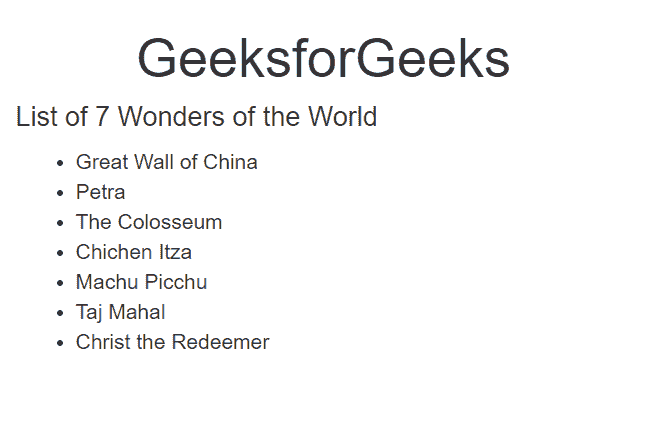
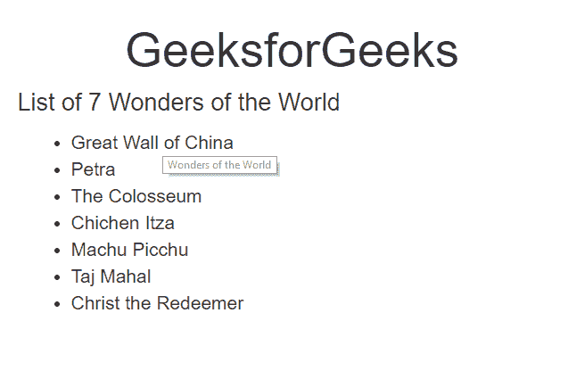

# 如何用 JavaScript 给 div 添加工具提示？

> 原文:[https://www . geeksforgeeks . org/how-add-a-tooltip-to-a-div-use-JavaScript/](https://www.geeksforgeeks.org/how-to-add-a-tooltip-to-a-div-using-javascript/)

每当鼠标悬停在 div 上时，将工具提示添加到 div 元素会显示一个弹出窗口。

**语法:**

```
< div title = "" > </div> 
<script>
    $(document).ready(function() {
        $('[data-toggle="tooltip"]').tooltip();
    }); 
</script>
```

**工具提示方法:**

*   **。工具提示(“显示”):**用于显示工具提示。
*   **。工具提示(“隐藏”):**用于隐藏工具提示。
*   **。工具提示(选项):**用于激活工具提示。
*   **。工具提示(“销毁”):**用于销毁工具提示。
*   **。工具提示(“切换”):**用于切换工具提示。

**工具提示事件:**

*   **show.bs.tooltip:** Tooltip 即将在屏幕上显示。
*   **show . bs . Tooltip:**Tooltip 完全显示在屏幕上。
*   **hide.bs.tooltip:** Tooltip 即将隐藏。
*   **隐藏. bs.tooltip:** Tooltip 完全隐藏。

**返回值:**当用户悬停在 div 元素上时，返回一个弹出窗口。

**例 1:**

```
<!DOCTYPE html>
<html lang="en">

<head>
    <title>
      Bootstrap Example
  </title>
    <meta charset="utf-8">
    <meta name="viewport"
          content="width=device-width, 
                   initial-scale=1">
    <link rel="stylesheet" 
          href=
"https://maxcdn.bootstrapcdn.com/bootstrap/3.4.0/css/bootstrap.min.css">

    <script src=
"https://ajax.googleapis.com/ajax/libs/jquery/3.4.1/jquery.min.js">
  </script>
    <script src=
"https://maxcdn.bootstrapcdn.com/bootstrap/3.4.0/js/bootstrap.min.js">
  </script>
</head>

<body>

    <div class="container"
         title="ToolTip">
        <h1 class="text-center ">
          GeeksforGeeks
      </h1>
        <h2 class="h4 text-center">
          A Computer Science Portal for Geeks
      </h2>

    </div>

    <script>
        $(document).ready(function() {
            $('[data-toggle="tooltip"]').tooltip();
        });
    </script>

</body>

</html>
```

**输出:**
**悬停在 div 上方前:**


**悬停在 div 上方后:**


**例 2:**

```
<!DOCTYPE html>
<html lang="en">

<head>
    <title>
      Bootstrap Example
  </title>
    <meta charset="utf-8">
    <meta name="viewport" 
          content="width=device-width,
                   initial-scale=1">
    <link rel="stylesheet" 
          href=
"https://maxcdn.bootstrapcdn.com/bootstrap/3.4.0/css/bootstrap.min.css">
    <script src=
"https://ajax.googleapis.com/ajax/libs/jquery/3.4.1/jquery.min.js">
  </script>
    <script src=
"https://maxcdn.bootstrapcdn.com/bootstrap/3.4.0/js/bootstrap.min.js">
  </script>
</head>

<body>

    <div class="container" 
         title="Wonders of the World">
        <h1 class="text-center ">
          GeeksforGeeks
      </h1>
        <h2 class="h4">
          List of 7 Wonders of the World
      </h2>
        <ul>
            <li>Great Wall of China</li>
            <li>Petra</li>
            <li>The Colosseum</li>
            <li>Chichen Itza</li>
            <li>Machu Picchu</li>
            <li>Taj Mahal</li>
            <li>Christ the Redeemer</li>
        </ul>

    </div>

    <script>
        $(document).ready(function() {
            $('[data-toggle="tooltip"]').tooltip();
        });
    </script>

</body>

</html>
```

**输出:**
**悬停在 div 上方前:**


**悬停在 div 上方后:**


**浏览器支持:**支持工具提示的浏览器:

*   歌剧
*   微软公司出品的 web 浏览器
*   旅行队
*   谷歌 Chrome
*   火狐浏览器