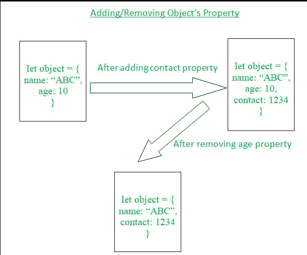

# 如何在 JavaScript 中添加和移除对象的属性？

> 原文:[https://www . geesforgeks . org/如何从 javascript 对象中添加和删除属性/](https://www.geeksforgeeks.org/how-to-add-and-remove-properties-from-objects-in-javascript/)

在本文中，我们将尝试理解如何向对象添加属性，以及如何在 JavaScript 中向对象添加或移除属性。

在我们实际查看对象属性的添加和移除之前，让我们先了解 JavaScript 中对象的基础知识。

**对象:**

*   JavaScript 中的对象是属性的集合。
*   JavaScript 对象中的单个属性实际上是名称(或键)和值之间的关联。
*   一个对象可以包含不同数量的属性，这些属性还具有不同的名称和值。

**语法:**通过使用以下语法，可以很容易地创建具有不同数量属性的对象。

```
let object_name =
{
    property_name: value,
    ...
}
```

现在我们已经理解了 JavaScript 中与对象相关的基本细节，让我们看一些在对象中添加属性以及如何从对象中移除属性的例子。

**添加/移除对象属性:**



*   如上图所示，我们可以通过遵循某些方法或技术，轻松地在 JavaScript 中添加或移除对象的几个属性。
*   要添加任何属性，可以使用*object _ name . property _ name = value***(或)*object _ name[“property _ name”]= value*。**
*   **要删除任何属性，可以很容易地使用*删除对象名称。属性名称(*或)*删除对象名称[“属性名称”]* 。**

**让我们看一些例子，以便更好地理解如何在对象中添加和移除属性。**

****示例 1:** 在本例中，我们首先创建一个对象，此外，我们将向其添加一些属性。**

## **java 描述语言**

```
<script>
    let object = {
        name: "ABC",
        email: "xyz@abc.com"
    };
    console.log(object);

    // Adding some properties into the
    // above created object...
    object.age = 10;
    object.contact = 123467890;
    object.place = "Earth";
    object["country"]= "India";

    console.log(object);
</script>
```

****输出:****

```
{ name: 'ABC', email: 'xyz@abc.com' }
{
  name: 'ABC',
  email: 'xyz@abc.com',
  age: 10,
  contact: 123467890,
  place: 'Earth',
  country: 'India'
}
```

****示例 2:** 在本例中，我们将首先创建一个对象，然后移除一些属性。**

## **java 描述语言**

```
<script>
    let object = {
        name: "ABC",
        email: "xyz@abc.com",
        age: 10,
        contact: 1234567890,
        place: "Earth",
        country: "India",
    };
    console.log(object);

    // Removing some properties
    // from the above created object
    delete object.age; // age property deletion
    console.log(object);

    // country property deletion
    delete object["country"];
    console.log(object);
    delete object.place; // place property deletion
    console.log(object);
</script>
```

****输出:****

```
{
  name: 'ABC',
  email: 'xyz@abc.com',
  age: 10,
  contact: 1234567890,
  place: 'Earth',
  country: 'India'
}
{
  name: 'ABC',
  email: 'xyz@abc.com',
  contact: 1234567890,
  place: 'Earth',
  country: 'India'
}
{
  name: 'ABC',
  email: 'xyz@abc.com',
  contact: 1234567890,
  place: 'Earth'
}
{
 name: 'ABC', 
 email: 'xyz@abc.com', 
 contact: 1234567890
}
```

****示例-3:****

*   **在本例中，我们将使用另一种方法从对象中移除属性。**
*   **这是不改变原始对象的最新方法。**
*   **这种方法被称为使用剩余参数的对象析构。**

## **java 描述语言**

```
let person_data = {
    first_name: "ABC",
    last_name: "DEF",
    age: 20,
    eye_color: "brown",
    place: "XYZ",
};

let { eye_color, ...remainingObject } = person_data;
console.log("Original Object...");
console.log(person_data);
console.log("Remaining Object.....");
console.log(remainingObject);

//Another way of Object Destructuing Approach Implementation......

let property_name = "place";
let { [property_name]: removedProperty, ...restObject } = person_data;
console.log("Remaining Object");
console.log(restObject);

//Another way of Object Destructuing Approach Implementation......
let { place, age, ...leftObject } = person_data;
console.log("Remaining Object");
console.log(leftObject);

// This code is contributed by Aman Singla....
```

****输出:****

```
Original Object...
{ first_name: 'ABC', last_name: 'DEF', age: 20, 
    eye_color: 'brown', place: 'XYZ' }
Remaining Object.....
{ first_name: 'ABC', last_name: 'DEF', age: 20, place: 'XYZ' }
Remaining Object
{ first_name: 'ABC', last_name: 'DEF', age: 20, eye_color: 'brown' }
Remaining Object
{ first_name: 'ABC', last_name: 'DEF', eye_color: 'brown' }
```