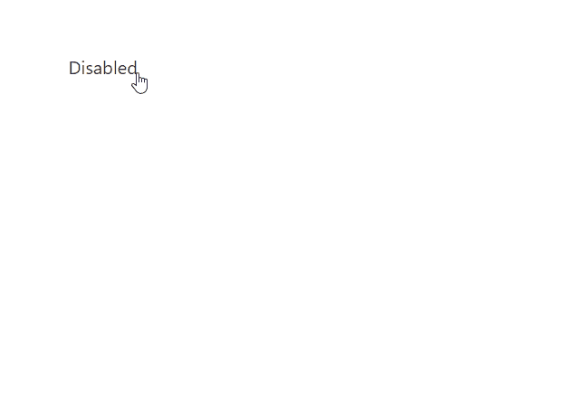
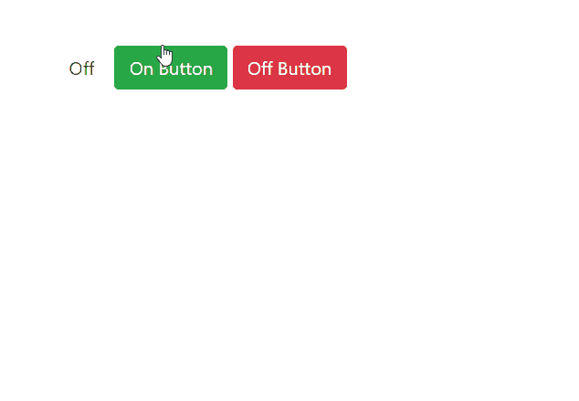

# 如何用 JavaScript 添加Bootstrap拨动开关？

> 原文:[https://www . geesforgeks . org/how-add-bootstrap-toggle-switch-using-JavaScript/](https://www.geeksforgeeks.org/how-to-add-bootstrap-toggle-switch-using-javascript/)

自举拨动开关是用于激活两个给定选项之一的简单组件。通常用作开/关按钮。

CSS 框架是一个库，允许使用级联样式表语言进行更简单、更符合标准的网页设计。Bootstrap 4 就是这样一个被 web 开发人员广泛使用的 CSS 框架，用于构建用户友好的交互式 web 应用程序。Bootstrap 和 JavaScript 一起帮助开发一个响应迅速的用户界面。

**进场:**

*   Bootstrap 有一个内置的数据切换属性，用于切换 Bootstrap 元素。
*   这里 bootstrapToggle()方法用于执行任务。bootstrapToggle()方法允许切换开关。如果开关被禁用，并且用户单击复选框，则开关切换到启用状态。如果复选框处于启用状态，则 bootstrapToggle()方法将其切换到禁用状态。

下面的代码片段演示了一个使用 JavaScript 的切换开关。

**例:**

## 超文本标记语言

```html
<!DOCTYPE html>
<html>

<head>

    <link rel="stylesheet" href=
"https://stackpath.bootstrapcdn.com/bootstrap/4.4.1/css/bootstrap.min.css" 
        integrity=
"sha384-Vkoo8x4CGsO3+Hhxv8T/Q5PaXtkKtu6ug5TOeNV6gBiFeWPGFN9MuhOf23Q9Ifjh" 
        crossorigin="anonymous">

    <script src=
        "https://code.jquery.com/jquery.min.js">
    </script>

    <script src=
"https://gitcdn.github.io/bootstrap-toggle/2.2.2/js/bootstrap-toggle.min.js">
    </script>

    <link href=
"https://gitcdn.github.io/bootstrap-toggle/2.2.2/css/bootstrap-toggle.min.css"
         rel="stylesheet"/>
</head>

<body>
    <div class="container mt-5">

        <!--Initialize toggles with id toggle-one
            with JavaScript.-->
        <input type="checkbox" id="toggle-one">

        <script>
            $(function() {
                $('#toggle-one').bootstrapToggle({
                    on: 'Enabled',
                    off: 'Disabled'
                });
            })
        </script>
    </div>
</body>

</html>
```

**输出:**



**替代方法:**

*   该开关还可以使用单个按钮进行切换，单击这些按钮时会触发一个 JavaScript 函数。
*   JavaScript 函数根据开关的先前状态来打开或关闭开关。
*   这里，toggleOn()方法打开开关，而 toggleOff()方法关闭开关。

**示例:**

## 超文本标记语言

```html
<!DOCTYPE html>
<html>

<head>

    <link rel="stylesheet" href=
"https://stackpath.bootstrapcdn.com/bootstrap/4.4.1/css/bootstrap.min.css" 
        integrity=
"sha384-Vkoo8x4CGsO3+Hhxv8T/Q5PaXtkKtu6ug5TOeNV6gBiFeWPGFN9MuhOf23Q9Ifjh" 
        crossorigin="anonymous">

    <script src=
        "https://code.jquery.com/jquery.min.js">
    </script>

    <script src=
"https://gitcdn.github.io/bootstrap-toggle/2.2.2/js/bootstrap-toggle.min.js">
    </script>

    <link href=
"https://gitcdn.github.io/bootstrap-toggle/2.2.2/css/bootstrap-toggle.min.css"
        rel="stylesheet"/>
</head>

<body>
    <div class="container mt-5">
        <input id="toggle-trigger" type="checkbox" 
            data-toggle="toggle">

        <button class="btn btn-success" onclick="toggleOn()">
            On Button
        </button>

        <button class="btn btn-danger" onclick="toggleOff()">
            Off Button
        </button>

    </div>
    <script>
        function toggleOn() {
            $('#toggle-trigger').bootstrapToggle('on')
        }
        function toggleOff() {
            $('#toggle-trigger').bootstrapToggle('off')  
        }
    </script>
</body>

</html>
```

**输出:**

