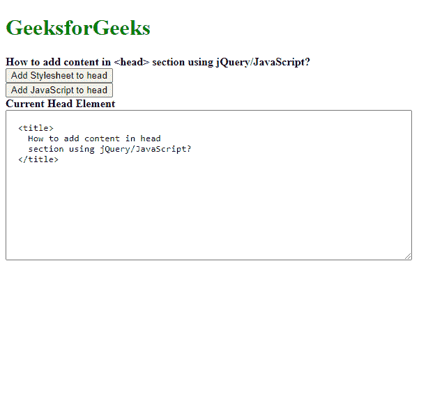
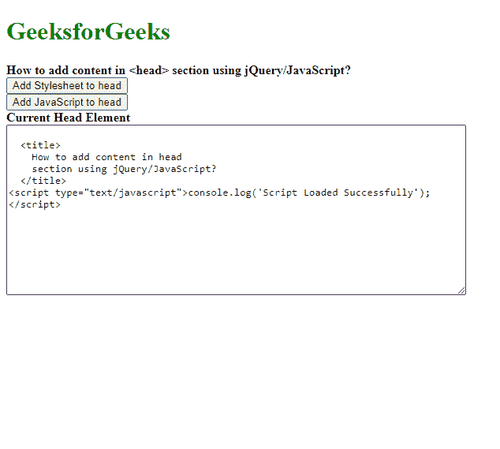
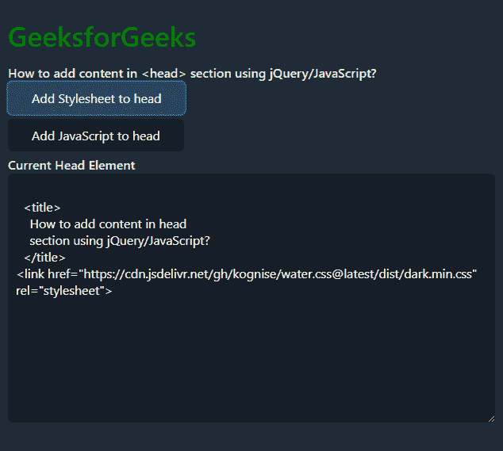
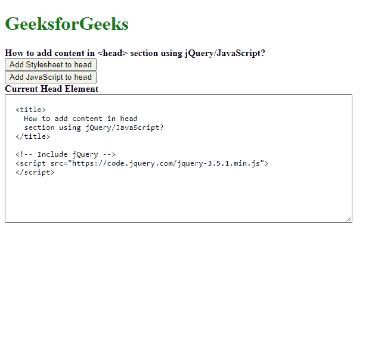
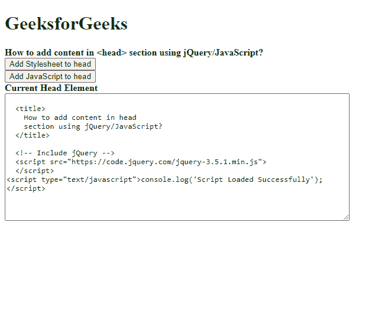
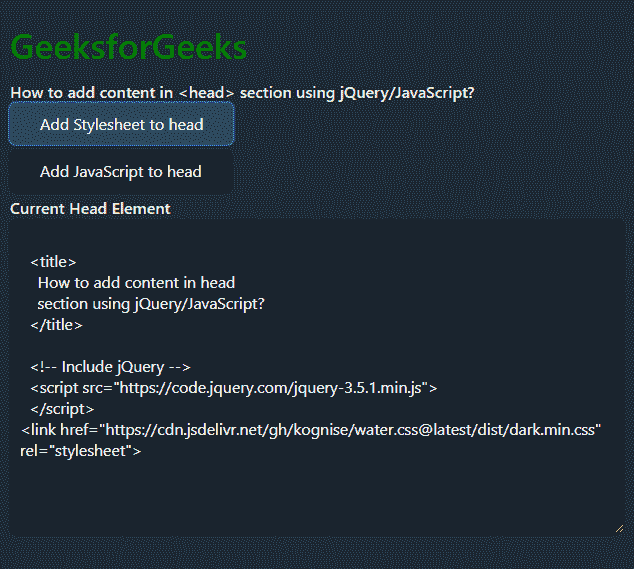

# 如何使用 jQuery/JavaScript 在小节中添加内容？

> 原文:[https://www . geesforgeks . org/how-in-content-head-section-use-jquery-JavaScript/](https://www.geeksforgeeks.org/how-to-add-content-in-head-section-using-jquery-javascript/)

可以使用以下两种方法将任何内容添加到部分:

1.  使用 document.head 属性
2.  使用 jQuery 选择头部元素

**方法 1:使用 document.head 属性:**文档的 head 属性返回文档的 head 元素。可以使用 **appendChild()** 方法向该元素添加任何新内容。首先可以使用 **createElement()** 方法创建要添加的内容，并为其分配所需的属性。appendChild()方法将创建的元素追加到文档的头部。

**语法:**

```html
document.head.appendChild( elementToAdd );
```

**示例:**

```html
<!DOCTYPE html>
<html lang="en">

<head>
  <title>
    How to add content in head section 
    using jQuery/JavaScript?
  </title>
</head>

<body>
  <h1 style="color: green;">
    GeeksforGeeks
  </h1>
  <b>
    How to add content in <head>
    section using jQuery/JavaScript?
  </b>

  <button onclick="addStylesheet()">
    Add Stylesheet to head
  </button>
  <br>

  <button onclick="addJS()">
    Add JavaScript to head
  </button>
  <br>
  <b>Current Head Element</b>
  <br>

  <textarea cols="80" rows="14" 
    class="head-element">
  </textarea>

  <script>
    function addStylesheet() {
      let linkToAdd
        = document.createElement('link');

      // Link to water.css stylesheet
      linkToAdd.href = 
'https://cdn.jsdelivr.net/gh/kognise/water.css@latest/dist/dark.min.css';

      linkToAdd.rel = 'stylesheet';

      // Get the head element of the document
      // and append the link
      document.head.appendChild(linkToAdd);

      // Update textarea
      updateHeadOutput();
    }

    function addJS() {
      let scriptToAdd
        = document.createElement('script');
      scriptToAdd.type
        = 'text/javascript';

      // Create contents of the script
      let inlineScript = document.createTextNode(
        "console.log('Script Loaded Successfully');");

      scriptToAdd.appendChild(inlineScript);

      // Uncomment to load script from another 
      // source
      // scriptToAdd.src = 'myscript.js';

      // Get the head element of the document
      // and append the script
      document.head.appendChild(scriptToAdd);

      // Update textarea
      updateHeadOutput();
    }

    function updateHeadOutput() {
      document.querySelector(".head-element")
        .textContent = document.head.innerHTML;
    }

    updateHeadOutput();
  </script>
</body>

</html>
```

**输出:**

*   **点击按钮前:**
    
*   **添加脚本后:**
    
*   **添加样式表后:**
    

**方法二:使用 jQuery 选择头部元素:**可以使用 jQuery 选择器选择文档的头部属性。可以使用 **append()** 方法将新内容添加到该选定元素中。首先可以使用 **createElement()** 方法创建要添加的内容。然后， **append()** 方法将在末尾创建的元素追加到所选元素，也就是头部。

**语法:**

```html
$('head').append( elementToAdd );
```

**示例:**

```html
<!DOCTYPE html>
<html lang="en">

<head>
  <title>
    How to add content in head section 
    using jQuery/JavaScript?
  </title>

  <!-- Include jQuery -->
  <script src=
"https://code.jquery.com/jquery-3.5.1.min.js">
  </script>
</head>

<body>
  <h1 style="color: green;">
    GeeksforGeeks
  </h1>
  <b>
    How to add content in <head>
    section using jQuery/JavaScript?
  </b>
  <button onclick="addStylesheet()">
    Add Stylesheet to head
  </button>
  <br>
  <button onclick="addJS()">
    Add JavaScript to head
  </button>
  <br>
  <b>Current Head Element</b>
  <br>

  <textarea cols="80" rows="14" 
    class="head-element">
  </textarea>

  <script>
    function addStylesheet() {
      let linkToAdd = 
        document.createElement('link');

      // Link to water.css stylesheet
      linkToAdd.href = 
'https://cdn.jsdelivr.net/gh/kognise/water.css@latest/dist/dark.min.css';

      linkToAdd.rel = 'stylesheet';

      // Select the head element
      // and append the created link
      $('head').append(linkToAdd);

      // Update textarea
      updateHeadOutput();
    }

    function addJS() {
      let scriptToAdd = 
        document.createElement('script');

      scriptToAdd.type = 'text/javascript';

      // Create contents of the script
      let inlineScript = document.createTextNode(
        "console.log('Script Loaded Successfully');");

      scriptToAdd.appendChild(inlineScript);

      // Uncomment to load script from another
      // file
      // scriptToAdd.src = 'myscript.js';

      // Select the head element
      // and append the script
      $('head').append(scriptToAdd);

      // Update textarea
      updateHeadOutput();
    }

    function updateHeadOutput() {
      document.querySelector(".head-element")
        .textContent = document.head.innerHTML;
    }

    updateHeadOutput();
  </script>
</body>

</html>
```

**输出:**

*   **点击按钮前:**
    
*   **添加脚本后:**
    
*   **添加样式表后:**
    