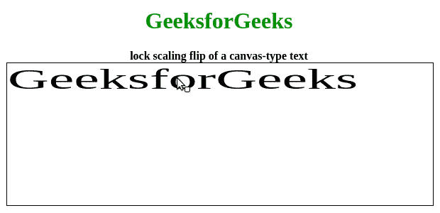

# 如何用 JavaScript 给画布型文本添加默认水平缩放？

> 原文:[https://www . geesforgeks . org/how-add-default-horizontal-scaling-to-a-canvas-type-text-with-JavaScript/](https://www.geeksforgeeks.org/how-to-add-default-horizontal-scaling-to-a-canvas-type-text-with-javascript/)

在本文中，我们将看到如何在 JavaScript 中将默认水平缩放添加到类似画布的文本中。像画布一样，我们的意思是书写的文本是可移动的，可旋转的，可调整大小的，并且可以拉伸。但是在本文中，我们将添加默认的水平缩放。此外，文本本身不能像文本框一样编辑。

为了实现这一点，我们将使用一个名为 FabricJS 的 JavaScript 库。使用 CDN 导入库后，我们将在主体标签中创建一个包含我们的文本的**画布**块。之后，我们将初始化由 FabricJS 提供的 Canvas 和 Text 实例，并使用 **scaleX** 属性添加默认水平缩放，并在 Text 上渲染 Canvas，如下例所示。

**语法:**

```html
 fabric.Text(text, scaleX: number); 
```

**参数:**该函数接受两个参数，如上所述，如下所述:

*   **文本:**指定要写入的文本。
*   **scaleX:** 指定默认水平缩放。

**示例:**我们可以使用 FabricJS 为类似画布的文本添加默认的水平缩放，如下所示。

## 超文本标记语言

```html
<!DOCTYPE html>
<html>

<head>
    <title>
        Add default horizontal scaling to a canvas-type text with JavaScript
    </title>

    <!-- Loading the FabricJS library -->
    <script src=
"https://cdnjs.cloudflare.com/ajax/libs/fabric.js/3.6.2/fabric.min.js">
    </script>
    <style>
        h1 {
            color: green;
        }
    </style>
</head>

<body>
    <center>
        <h1>GeeksforGeeks</h1>
        <b>lock scaling flip of a canvas-type text</b>
        <canvas id="canvas" width="600" height="200"
                style="border:1px solid #000000;">
        </canvas>
        <script>

            // Create a new instance of Canvas
            var canvas = new fabric.Canvas("canvas");

            // Create a new Text instance
            var text = new fabric.Text('GeeksforGeeks', {
            scaleX: 2
            });

            // Render the text on Canvas
            canvas.add(text);
        </script>
    </center>
</body>

</html>                    
```

**Output:**