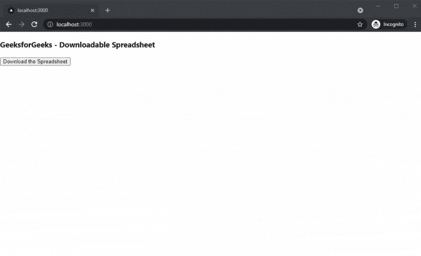

# 如何在 Next.js 中添加可下载的电子表格？

> 原文:[https://www . geesforgeks . org/如何添加-下载-下一个电子表格-js/](https://www.geeksforgeeks.org/how-to-add-downloadable-spreadsheet-in-next-js/)

在本文中，我们将学习如何在 NextJs 中添加可下载的电子表格。NextJS 是一个基于 React 的框架。它有能力为不同的平台开发漂亮的网络应用程序，如视窗、Linux 和 mac。动态路径的链接有助于有条件地呈现您的 NextJS 组件。

**方法:**要添加可下载的电子表格，我们将使用 react-xls 包。react-xls 包帮助我们在应用程序的任何地方添加可下载的电子表格。首先，我们将安装 react-xls 包，然后我们将在主页上添加一个可下载的电子表格。

**创建 NextJS 应用程序:**您可以使用以下命令创建一个新的 NextJs 项目:

```
npx create-next-app gfg
```

**安装所需的包:**现在我们将使用以下命令安装 react-xls 包:

```
npm i react-xls
```

**项目结构:**会是这样的。


**添加电子表格:**我们可以在安装 react-xls 软件包后，在应用程序中轻松添加可下载的电子表格。对于这个例子，我们将把可下载的电子表格添加到我们的主页。

在 **index.js** 文件中添加以下内容:

## java 描述语言

```
import React from 'react';
import { useExcelDownloder } from 'react-xls';

function App() {
  const { ExcelDownloder, Type } = useExcelDownloder();

  const data = {
    Data1: [
      { name: 'gfg1', category: 'gfg4' },
      { name: 'gfg2', category: 'gfg5' },
      { name: 'gfg3', category: 'gfg6' },
    ],
    // Worksheet named pokemons
    Data2: [
      { name: 'gfg1', category: 'gfg1' },
      { name: 'gfg1', category: 'gfg1' },
      { name: 'gfg1', category: 'gfg1' },
    ],
  };

  return (
    <div>
      <h3>GeeksforGeeks - Downloadable Spreadsheet</h3>
      <ExcelDownloder
        data={data}
        filename={'book'}
        type={Type.Button} // or type={'button'}
      >
        Download the Spreadsheet
      </ExcelDownloder>
    </div>
  );
}

export default App;
```

**说明:**首先在上面的例子中，我们是从已安装的包中导入 useExcelDownloader。之后，我们将创建一个新的数据变量，在其中存储电子表格的数据。然后，我们将使用 useExcelDownloader 将这些数据添加到可下载的电子表格中。

**运行应用的步骤:**在终端运行下面的命令运行应用。

```
npm run dev
```

### 输出:

