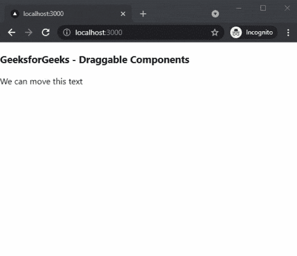

# 如何在 Next.js 中添加可拖动组件？

> 原文:[https://www . geesforgeks . org/how-add-draggable-components-in-next-js/](https://www.geeksforgeeks.org/how-to-add-draggable-components-in-next-js/)

在本文中，我们将学习如何在 NextJs 中添加可拖动组件。NextJS 是一个基于 React 的框架。它有能力为不同的平台开发漂亮的网络应用程序，如视窗、Linux 和 mac。动态路径的链接有助于有条件地呈现您的 NextJS 组件。

**方法:**要添加我们的可拖动组件，我们将使用反应可拖动包。react-drag able 包帮助我们在应用程序的任何地方添加可拖动的组件。首先，我们将安装 react-drag able 包，然后我们将在主页上添加一个 drag able 组件。

**创建 NextJS 应用程序:**您可以使用以下命令创建一个新的 NextJs 项目:

```
npx create-next-app gfg
```

**安装所需的包:**现在我们将使用以下命令安装可拖动反应包:

```
npm i react-draggable
```

**项目结构:**会是这样的。


**添加可拖动组件:**安装反应可拖动包后，我们可以在应用程序中轻松添加可拖动组件。在这个例子中，我们将向我们的主页添加一个可拖动的组件。

在 **index.js** 文件中添加以下内容:

## java 描述语言

```
import Draggable from 'react-draggable';
import React from 'react'

export default function DraggableComponents() {
  return (
    <div>
      <h3>GeeksforGeeks - Draggable Components</h3>
      <Draggable>
        <div>We can move this text</div>
      </Draggable>
    </div>
  )
}
```

**解释:**在上面的例子中，首先，我们从已安装的包中导入我们的可拖动组件。之后，我们将创建一个名为 DraggableComponents 的新函数，然后我们将使用刚刚从已安装的包中导入的 Draggable components。

**运行应用的步骤:**在终端运行下面的命令运行应用。

```
npm run dev
```

### 输出:

