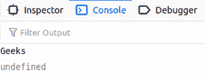
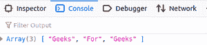

# 如何在 JavaScript 中动态向已有数组添加元素？

> 原文:[https://www . geesforgeks . org/如何在 javascript 中动态向现有数组添加元素/](https://www.geeksforgeeks.org/how-to-add-elements-to-an-existing-array-dynamically-in-javascript/)

数组是一个 JavaScript 对象，一次可以保存多个值，与数据类型无关。

**示例:**

```
var a = ['Geeks', 'For', 'Geeks', 1];

```

在上面的例子中，“极客”是“字符串”类型，而 1 是“整数”类型。数组也可以存储 JavaScript 对象。JavaScript 数组本质上是动态的，它们在初始化时不需要大小。使用编号索引来访问它们。

```
console.log(a[1]);

```

上面的语句在控制台窗口中打印上面示例中的“For”。

**输出:**

```
For
```

或者

```
document.write(a[1]);
```

**输出:**

```
For
```

要在 JavaScript 中将元素动态添加到数组中，程序员可以使用以下任何方法。

**方法 1:** 使用数字索引向指定的索引添加元素。

## Java Script 语言

```
<script>
    // JavaScript Array Initialization
    var a = ['Hi', 'There'];

    // New element added dynamically.
    a[3] = 'Geeks';

    document.write(a[3]);
    document.write("<br>");
    document.write(a[2]);
</script>
```

**输出:控制台窗口上的**



可以看出，索引{0，1}仅被声明。索引 3 被动态创建并初始化为“极客”。索引 2 是自动创建的，并初始化为未定义，以保持顺序。

**方法二:**使用**推()**方法用于在数组末尾添加元素。

## Java Script 语言

```
<script>
    // JavaScript Array Declared
    var a = [];

    // Elements pushed into the 
    // array using push() method
    a.push('Geeks');
    a.push('For');
    a.push('Geeks');

    // Obtaining the value
    document.write(a);
</script>
```

**输出:**



控制台窗口显示一个包含 3 个值的数组对象，它们是['极客'，' For '，'极客']。 **push()** 方法通过在数组末尾添加新元素来保持索引的顺序，并返回数组的新长度。