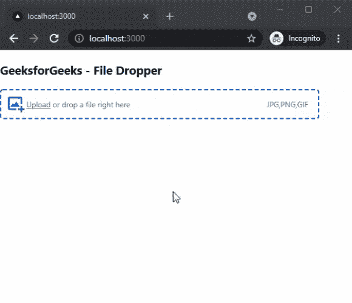

# 如何在 Next.js 中添加 File Dropper？

> 原文:[https://www . geesforgeks . org/how-add-file-dropper-in-next-js/](https://www.geeksforgeeks.org/how-to-add-file-dropper-in-next-js/)

在本文中，我们将学习如何在 NextJs 中添加 File Dropper。NextJS 是一个基于 React 的框架。它有能力为不同的平台开发漂亮的网络应用程序，如视窗、Linux 和 mac。动态路径的链接有助于有条件地呈现您的 NextJS 组件。

**方法:**要添加我们的文件滴管，我们将使用反应-拖放-文件包。反应拖放文件包帮助我们在我们的应用程序中的任何地方集成文件滴管。首先，我们将安装反应拖放文件包，然后我们将在我们的主页上添加一个文件滴管。

**创建 NextJS 应用程序:**您可以使用以下命令创建一个新的 NextJs 项目:

```
npx create-next-app gfg
```

**安装所需的包:**现在我们将使用以下命令安装反应-拖放-文件包:

```
npm i react-drag-drop-files
```

**项目结构:**会是这样的。


**添加文件滴管:**安装反应-拖放-文件包后，我们可以很容易地在我们的应用程序中添加文件滴管。对于这个例子，我们将添加一个文件滴管到我们的主页。

在 **index.js** 文件中添加以下内容:

## java 描述语言

```
import React, { useState } from "react";
import { FileUploader } from "react-drag-drop-files";

const fileTypes = ["JPG", "PNG", "GIF"];

function DragDrop() {
  const [file, setFile] = useState(null);
  const handleChange = file => {
    setFile(file);
  };
  return (
    <div>
      <h3>GeeksforGeeks - File Dropper</h3>
      <FileUploader 
        handleChange={handleChange} 
        name="file" 
        types={fileTypes} 
      />
    </div>

  );
}

export default DragDrop;
```

**解释:**在上面的例子中，首先，我们从已安装的包中导入我们的文件上传器组件。之后，我们创建一个新的常量变量来存储接受的文件类型，然后我们使用 useState 钩子来设置文件数据。然后，我们使用文件上传器组件添加我们的文件丢弃器。

**运行应用的步骤:**在终端运行下面的命令运行应用。

```
npm run dev
```

### 输出:

