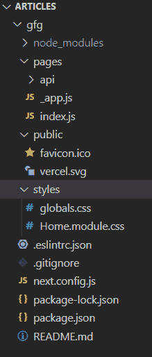
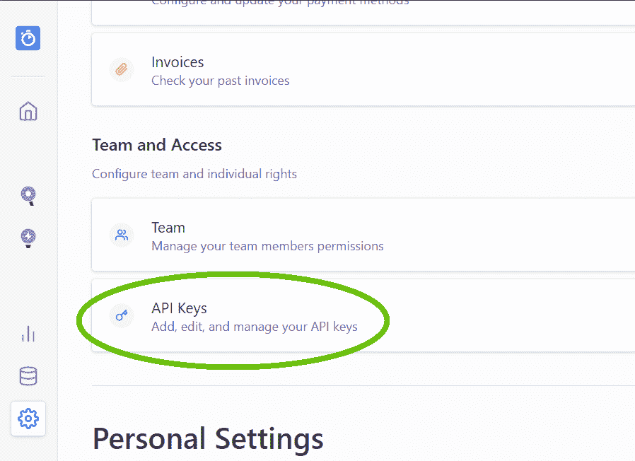
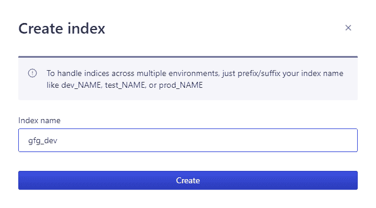
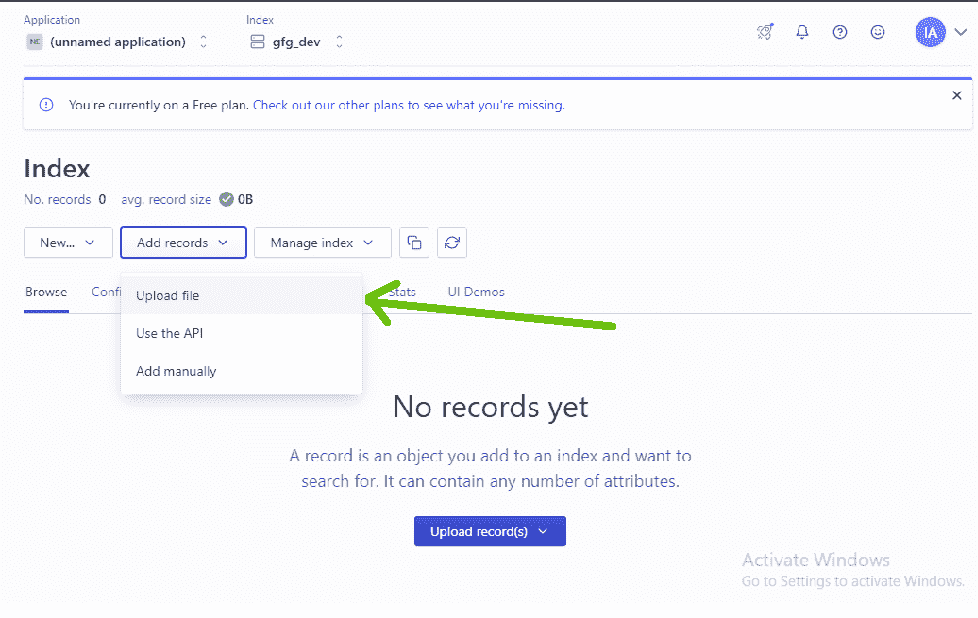
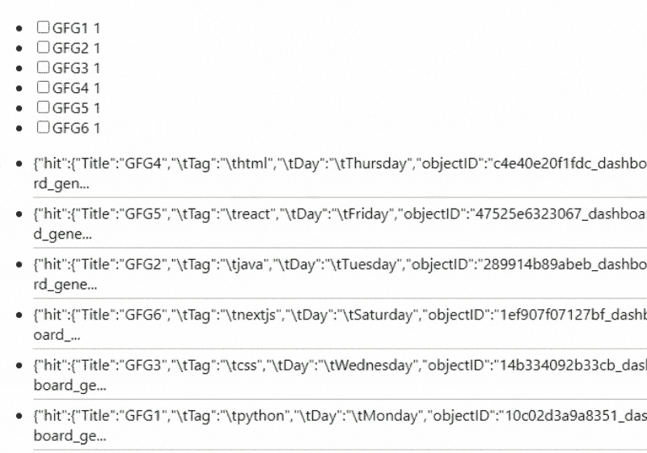
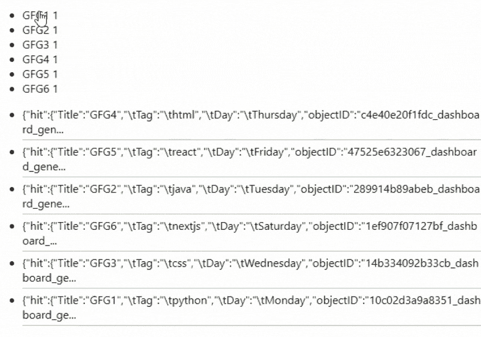
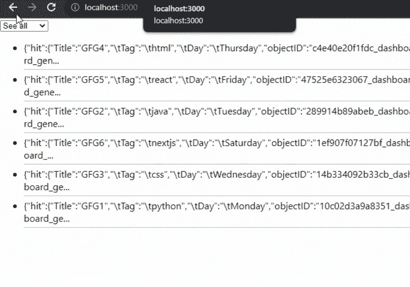

# 如何使用 Algolia 在 Next.js 中添加滤镜？

> 原文:[https://www . geesforgeks . org/如何添加过滤器-下一个 js-use-algolia/](https://www.geeksforgeeks.org/how-to-add-filters-in-next-js-using-algolia/)

在本文中，我们将学习如何使用 Algolia 在 NextJS 项目中添加过滤器。NextJS 是一个基于 React 的框架。它有能力为不同的平台开发漂亮的网络应用程序，如视窗、Linux 和 mac。动态路径的链接有助于有条件地呈现您的 NextJS 组件。

**方法:**首先添加我们的过滤器，我们将在 algolia 创建一个帐户，使我们能够在几毫秒内搜索内容。之后，我们将获得我们稍后将在应用程序中使用的应用编程接口密钥。然后我们将创建一个新的索引来上传我们的数据。在我们应用程序的主页上，我们将使用 API 键和 algoliasearch 模块从 algolia 获取带有过滤器小部件的数据。

#### 创建下一个应用程序:

**步骤 1:** 您可以使用以下命令创建一个新的 NextJs 项目:

```
npx create-next-app gfg
```

**步骤 2:** 为了在我们的项目中添加 Algolia 搜索，我们将安装两个模块:

```
npm install algoliasearch react-instantsearch-dom
```

**项目结构:**如下图。



**步骤 3:** 设置 Algolia。Algolia 使开发人员能够构建下一代应用程序，这些应用程序的 API 可以在几毫秒内提供相关内容。所以要使用 algolia，首先创建一个免费账户，并获取该账户的 API 密钥。

1.要获取应用编程接口密钥，请转到设置>应用编程接口密钥



2.之后，创建一个索引并上传您想要过滤的数据。您可以以 JSON、CSV 格式或使用它们的应用编程接口上传数据。



对于这个例子，我正在上传下面的数据。

```
Title, Tag,    Day
GFG1, python,  Monday
GFG2, java,    Tuesday
GFG3, CSS,     Wednesday
GFG4, HTML,    Thursday
GFG5, react,   Friday
GFG6, nextjs,  Saturday
```



**添加复选框过滤器:**您可以使用 algolia 的 RefinementList 小部件轻松添加复选框过滤器。使用这个小部件，用户可以基于方面值过滤数据集。小部件只显示当前搜索上下文最相关的方面值。现在我们将在我们的**索引. js** 文件中添加下面的代码。在下面的代码中，首先，我们导入我们的 RefinementList，然后，我们用 Title 属性调用我们的 RefinementList。

```
import algoliasearch from "algoliasearch/lite";
import { InstantSearch, RefinementList , Hits } from 
    "react-instantsearch-dom";

const searchClient = algoliasearch(
  "API_KEY",
  "SEARCHABLE_KEY",
);

export default function SearchBar() {
  return (
    <>
      <InstantSearch 
        searchClient={searchClient} 
        indexName="gfg_dev">
        <RefinementList attribute="Title" />
        <Hits />
      </InstantSearch>
    </>
  );
}
```

**运行应用程序的步骤:**使用以下代码运行应用程序。

```
npm run dev
```

#### 输出:



**添加 onclick 滤镜:**可以使用 algolia 的 Menu 小部件轻松添加 Onclick 滤镜。使用这个小部件，用户可以基于方面值过滤数据集。小部件只显示当前搜索上下文最相关的方面值。现在我们将在我们的**索引. js** 文件中添加下面的代码。在下面的代码中，首先，我们导入我们的菜单，然后，我们用 Title 属性调用我们的菜单。

```
import algoliasearch from "algoliasearch/lite";
import { InstantSearch, Menu , Hits } from "react-instantsearch-dom";

const searchClient = algoliasearch(
  "API_KEY",
  "SEARCHABLE_KEY",
);

export default function SearchBar() {
  return (
    <>
      <InstantSearch 
        searchClient={searchClient} 
        indexName="gfg_dev">
        <Menu attribute="Title" />
        <Hits />
      </InstantSearch>
    </>
  );
}
```

**运行应用程序的步骤:**使用以下代码运行应用程序。

```
npm run dev
```

#### 输出:



**添加下拉过滤器:**可以使用 algolia 的 MenuSelect 小部件轻松添加下拉过滤器。使用这个小部件，用户可以基于方面值过滤数据集。小部件只显示当前搜索上下文最相关的方面值。现在我们将在我们的 index.js 文件中添加下面的代码。在下面的代码中，首先，我们导入我们的菜单选项，然后，我们用标题属性调用我们的菜单选项。

```
import algoliasearch from "algoliasearch/lite";
import { InstantSearch, MenuSelect , Hits } from "react-instantsearch-dom";

const searchClient = algoliasearch(
  "API_KEY",
  "SEARCHABLE_KEY",
);

export default function SearchBar() {
  return (
    <>
      <InstantSearch 
        searchClient={searchClient} 
        indexName="gfg_dev">
        <MenuSelect attribute="Title" />
        <Hits />
      </InstantSearch>
    </>
  );
}
```

**运行应用程序的步骤:**使用以下代码运行应用程序。

```
npm run dev
```

#### 输出:

