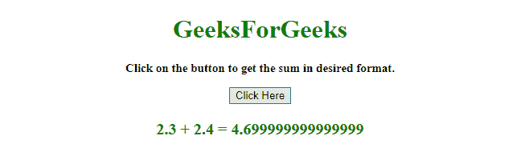
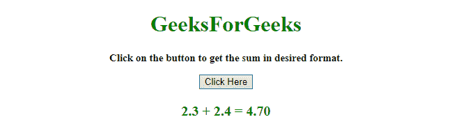
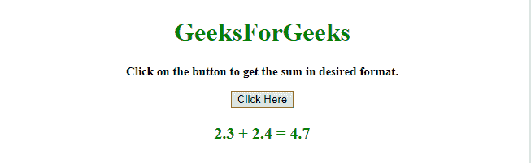

# 如何用 JavaScript 添加浮点数？

> 原文:[https://www . geesforgeks . org/如何使用 javascript 添加浮点数/](https://www.geeksforgeeks.org/how-to-add-float-numbers-using-javascript/)

给定两个或更多的数字，任务是在 JavaScript 的帮助下以期望的格式获得浮点加法。有两种方法可以解决这个问题，讨论如下:

**方法 1:**

*   给定两个或两个以上的数字来求和浮点数。
*   使用 **[parseFloat()](https://www.geeksforgeeks.org/javascript-parsefloat-with-examples/)** 和 **[toFixed()方法](https://www.geeksforgeeks.org/javascript-tofixed-function/)** 相应地格式化输出。

**示例:**该示例实现了上述方法。

```
<!DOCTYPE HTML> 
<html> 

<head> 
    <title> 
        Float sum with JavaScript.
    </title>
</head> 

<body style = "text-align:center;"> 

    <h1 style = "color:green;" > 
        GeeksForGeeks 
    </h1>

    <p id = "GFG_UP" style =
        "font-size: 15px; font-weight: bold;">
    </p>

    <button onclick = "gfg_Run()"> 
        Click Here
    </button>

    <p id = "GFG_DOWN" style = "color:green;
        font-size: 20px; font-weight: bold;">
    </p>

    <script>
        var el_up = document.getElementById("GFG_UP");
        var el_down = document.getElementById("GFG_DOWN");

        el_up.innerHTML = "Click on the button to get the"
                          + " sum in desired format.";

        var val = parseFloat('2.3')+parseFloat('2.4');
        el_down.innerHTML = "2.3 + 2.4 = " + val;

        function gfg_Run() {
            el_down.innerHTML = "2.3 + 2.4 = " 
                        + (parseFloat('2.3') + 
                        parseFloat('2.4')).toFixed(2);
        } 
    </script> 
</body> 

</html>
```

**输出:**

*   **点击按钮前:**
    
*   **点击按钮后:**
    

**方法 2:**

*   给定两个或两个以上的数字来求和浮点数。
*   使用 **[parseFloat()](https://www.geeksforgeeks.org/javascript-parsefloat-with-examples/)** 和 **[Math.round()方法](https://www.geeksforgeeks.org/javascript-math-round-function/)** 获得想要的输出。

**示例:**该示例实现了上述方法。

```
<!DOCTYPE HTML> 
<html> 

<head> 
    <title> 
        Float sum with javascript.
    </title>
</head> 

<body style = "text-align:center;"> 

    <h1 style = "color:green;" > 
        GeeksForGeeks 
    </h1>

    <p id = "GFG_UP" style =
        "font-size: 15px; font-weight: bold;">
    </p>

    <button onclick = "gfg_Run()"> 
        Click Here
    </button>

    <p id = "GFG_DOWN" style = "color:green;
        font-size: 20px; font-weight: bold;">
    </p>

    <script>
        var el_up = document.getElementById("GFG_UP");
        var el_down = document.getElementById("GFG_DOWN");

        el_up.innerHTML = "Click on the button to get the"
                          + " sum in desired format.";

        var val = parseFloat('2.3')+parseFloat('2.4');
        el_down.innerHTML = "2.3 + 2.4 = " + val;

        function gfg_Run() {
            el_down.innerHTML = "2.3 + 2.4 = " + 
                    Math.round((parseFloat('2.3')
                    + parseFloat('2.4'))*100)/100;
        } 
    </script> 
</body> 

</html>
```

**输出:**

*   **点击按钮前:**
    
*   **点击按钮后:**
    