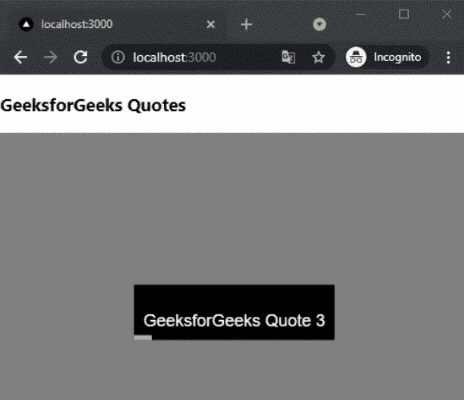

# 如何在 Next.js 中添加加载报价？

> 原文:[https://www . geesforgeks . org/how-add-loading-quotes-in-next-js/](https://www.geeksforgeeks.org/how-to-add-loading-quotes-in-next-js/)

在本文中，我们将学习如何在 NextJs 中添加加载报价。NextJS 是一个基于 React 的框架。它有能力为不同的平台开发漂亮的网络应用程序，如视窗、Linux 和 mac。动态路径的链接有助于有条件地呈现您的 NextJS 组件。

**方法:**要添加装载报价，我们将使用 react-loader-quotes 包。react-loader-quotes 包帮助我们在应用程序的任何地方添加加载报价。首先，我们将安装 react-loader-quotes 包，然后我们将在主页上添加报价。

**创建 NextJS 应用程序:**您可以使用以下命令创建一个新的 NextJs 项目:

```
npx create-next-app gfg
```

**安装所需的包:**现在我们将使用以下命令安装 react-loader-quotes 包:

```
npm i react-loader-quotes
```

**项目结构:**会是这样的。


**添加报价:**我们可以在安装了 react-loader-quotes 包后，在应用程序中轻松添加报价。对于这个例子，我们将在我们的主页上添加报价。

在 **index.js** 文件中添加以下内容:

## java 描述语言

```
import React from "react";
import ReactLoaderQuotes from 'react-loader-quotes';

export default function MyQuotesSlider() {
  return (
    <div>
      <h3>GeeksforGeeks Quotes</h3>
      <ReactLoaderQuotes
      loading={true}
      quotes={[`GeeksforGeeks Quote 1`,
               `GeeksforGeeks Quote 2`, 
               `GeeksforGeeks Quote 3`, 
               `GeeksforGeeks Quote 4`]}
      />
    </div>
  );
}
```

**说明:**首先在上面的例子中，我们从已安装的包中导入 ReactLoaderQuotes 组件。之后，我们将使用 ReactLoaderQuotes 的 quotes 参数添加报价。

**运行应用的步骤:**在终端运行下面的命令运行应用。

```
npm run dev
```

### 输出:

