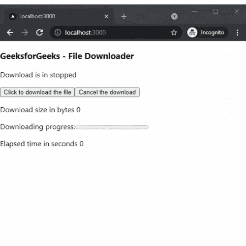

# 如何在 Next.js 中添加媒体下载器？

> 原文:[https://www . geesforgeks . org/如何添加媒体下载器下一个 js/](https://www.geeksforgeeks.org/how-to-add-media-downloader-in-next-js/)

在本文中，我们将学习如何在 NextJs 中添加媒体下载器。NextJS 是一个基于 React 的框架。它有能力为不同的平台开发漂亮的网络应用程序，如视窗、Linux 和 mac。动态路径的链接有助于有条件地呈现您的 NextJS 组件。

**方法:**要添加我们的媒体下载器，我们将使用反应使用下载器包。react-use-downloader 包可以帮助我们在应用程序的任何地方添加评价。首先，我们将安装反应使用下载器包，然后我们将在我们的主页上添加媒体下载器。

**创建 NextJS 应用程序:**您可以使用以下命令创建一个新的 NextJs 项目:

```
npx create-next-app gfg
```

**安装所需的软件包:**现在我们将使用以下命令安装 react-use-downloader 软件包:

```
npm i react-use-downloader
```

**项目结构:**会是这样的。


**添加媒体下载器:**我们可以在安装了 react-use-downloader 软件包后，在我们的 app 中轻松添加媒体下载器。对于这个例子，我们将添加媒体下载器到我们的主页。

在 **index.js** 文件中添加以下内容:

## index.js

```
import React from "react";
import useDownloader from "react-use-downloader";

export default function App() {
  const { size, elapsed, percentage, download,
        cancel, error, isInProgress } =
    useDownloader();

  const fileUrl = "/File.pdf";
  const filename = "File.pdf";

  return (
    <div className="App">
      <h3>GeeksforGeeks - File Downloader</h3>
      <p>Download is in {isInProgress ? 
        "in progress" : "stopped"}</p>

      <button onClick={() => download(fileUrl, filename)}>
        Click to download the file
      </button>
      <button onClick={() => cancel()}>
        Cancel the download
      </button>
      <p>Download size in bytes {size}</p>

      <label for="file">Downloading progress:</label>
      <progress id="file" value={percentage} max="100" />
      <p>Elapsed time in seconds {elapsed}</p>
      {error && <p>possible error {JSON.stringify(error)}</p>}
    </div>
  );
}
```

**说明:**首先在上面的例子中，我们从已安装的包中导入 useDownloader 组件。之后，我们添加我们的文件和文件名。然后我们添加进度条、开始下载和停止下载按钮。

**运行应用的步骤:**在终端运行以下命令运行应用

```
npm run dev
```

### 输出:

