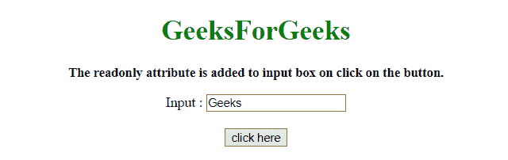
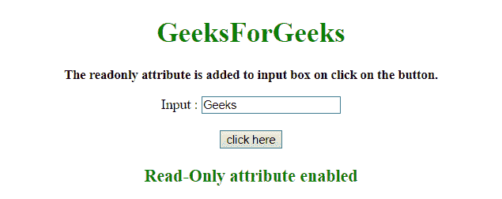

# 如何在 JavaScript 中给输入标签添加 readonly 属性？

> 原文:[https://www . geesforgeks . org/how-add-readonly-attribute-to-input-tag-in-JavaScript/](https://www.geeksforgeeks.org/how-to-add-readonly-attribute-to-an-input-tag-in-javascript/)

使用 setAttribute()方法，使用 JavaScript 将**只读属性**添加到表单输入字段中。

**setAttribute()方法:**该方法将已定义的属性添加到元素中，并赋予其已定义的值。如果指定的属性已经存在，则正在设置或更改该值。

**语法:**

```
element.setAttribute( attributeName, attributeValue )
```

**参数:**

*   **属性名:**必选参数。它指定要添加的属性的名称。
*   **属性值:**必选参数。它指定要添加的属性值。

**示例 1:** 在本示例中，通过访问属性来启用表单输入文本字段的**只读属性**。

```
<!DOCTYPE HTML> 
<html> 
    <head> 
        <title> 
            Add a readonly attribute to an input tag
        </title>
    </head> 

    <body style = "text-align:center;"> 

        <h1 style = "color:green;" > 
            GeeksForGeeks 
        </h1>

        <p style = "font-size: 15px; font-weight: bold;">
            The readonly attribute is added to input
            box on click on the button.
        </p>

        <form>
            Input : <input id = "Input" type="text"
                name="input_field" />
        </form>
        <br>

        <button onclick = "GFG_Run()">
            click here
        </button>

        <p id = "GFG_down" style = 
            "color: green; font-size: 20px; font-weight: bold;">
        </p>

        <script>
            function GFG_Run() {
                document.getElementById('Input').readOnly
                        = true;

                document.getElementById("GFG_down").innerHTML
                        = "Read-Only attribute enabled";
            }
        </script> 
    </body> 
</html>                    
```

**输出:**

*   **之前点击按钮:**
    
*   **点击按钮后:**
    

**示例 2:** 在本例中，表单输入文本字段的**只读属性**是通过使用**设置属性()方法**启用的。

```
<!DOCTYPE HTML> 
<html> 
    <head> 
        <title>
            Add a readonly attribute to an input tag
        </title>
    </head> 

    <body style = "text-align:center;"> 

        <h1 style = "color:green;" > 
            GeeksForGeeks 
        </h1>

        <p style = "font-size: 15px; font-weight: bold;">
            The readonly attribute is added to input box
            on click on the button.
        </p>

        <form>
            Input : <input id = "Input" type="text"
                    name="input_field" />
        </form>
        <br>

        <button onclick = "GFG_Run()">
            click here
        </button>

        <p id = "GFG_down" style = 
            "color: green; font-size: 20px; font-weight: bold;">
        </p>

        <script>
            function GFG_Run() {
                document.getElementById('Input').setAttribute('readonly', true);

                document.getElementById("GFG_down").innerHTML
                        = "Read-Only attribute enabled";
            }
        </script> 
    </body> 
</html>                    
```

**输出:**

*   **之前点击按钮:**
    
*   **点击按钮后:**
    