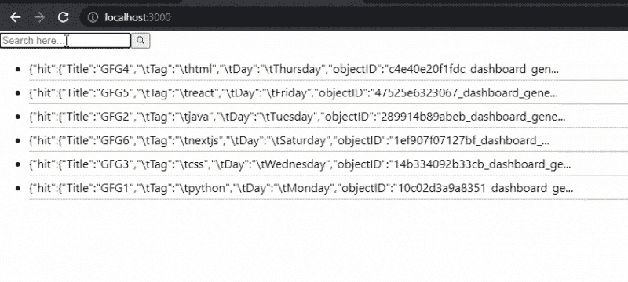

# 如何使用 Algolia 在 Next.js 中添加搜索功能？

> 原文:[https://www . geesforgeks . org/how-add-search-feature-in-next-js-using-algolia/](https://www.geeksforgeeks.org/how-to-add-search-feature-in-next-js-using-algolia/)

在本文中，我们将学习如何使用 Algolia 在 NextJS 项目中搜索特性。NextJS 是一个基于 React 的框架。它有能力为不同的平台开发漂亮的网络应用程序，如视窗、Linux 和 mac。动态路径的链接有助于有条件地呈现您的 NextJS 组件。

**方法:**要添加我们的搜索功能，首先我们要在 algolia 创建一个帐户，使我们能够在几毫秒内搜索内容。之后，我们将获得我们稍后将在应用程序中使用的应用编程接口密钥。然后我们将创建一个新的索引来上传我们的数据。在我们应用程序的主页上，我们将使用 API 键和 algoliasearch 模块从 algolia 获取带有搜索小部件的数据。

**创建下一个应用程序:**

**步骤 1:** 您可以使用以下命令创建一个新的 NextJs 项目:

```
npx create-next-app gfg
```

**步骤 2:** 为了在我们的项目中添加 Algolia 搜索，我们将安装两个模块:

```
npm install algoliasearchreact-instantsearch-dom
```

**项目结构:**如下图。


**第三步:设置 Algolia。** Algolia 使开发人员能够构建下一代应用程序，其 API 可以在几毫秒内交付相关内容。所以要使用 algolia，首先创建一个免费账户，并获取该账户的 API 密钥。

1.获取应用编程接口密钥转到**设置** > **应用编程接口密钥**


2.之后，创建一个索引并上传您想要搜索的数据。您可以以 JSON、CSV 格式或使用它们的应用编程接口上传数据。


对于这个例子，我正在上传下面的数据。

```
Title,    Tag,         Day
GFG1,    python,       Monday
GFG2,    java,         Tuesday
GFG3,    CSS,          Wednesday
GFG4,    HTML,         Thursday
GFG5,    react,        Friday
GFG6,    nextjs,       Saturday
```


**第四步:**现在我们可以使用 API 在 NextJs Project 中添加搜索功能了。之后，为了使用我们的搜索栏，我们将在 **index.js** 文件中添加下面的代码。

## java 描述语言

```
// Importing modules
import algoliasearch from "algoliasearch/lite";
import { InstantSearch, SearchBox, Hits }
    from "react-instantsearch-dom";

const searchClient = algoliasearch(
  APPLICATION_API_KEY,
  SEARCH_ONLY_API_KEY,
);

export default function SearchBar() {
  return (
    <>
      <InstantSearch 
        searchClient={searchClient} 
        indexName="gfg_dev">

        {/* Adding Search Box */}
        <SearchBox />

        {/* Adding Data */}
        <Hits />
      </InstantSearch>
    </>
  );
}
```

**运行应用的步骤:**现在在终端运行下面的代码，在开发服务器中启动应用:-

```
npm run dev
```

### 输出:

