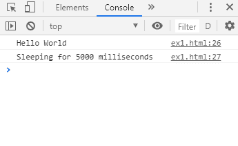
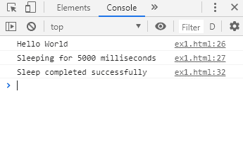
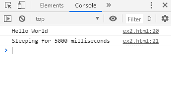

# 在 JavaScript 中继续之前如何添加睡眠/等待功能？

> 原文:[https://www . geeksforgeeks . org/如何在 javascript 中添加-睡眠-等待-函数-继续/](https://www.geeksforgeeks.org/how-to-add-sleep-wait-function-before-continuing-in-javascript/)

与其他语言不同，JavaScript 没有任何方法来模拟 sleep()函数。有一些方法可以用来模拟睡眠功能。

**方法 1:使用无限循环继续检查经过的时间**
睡眠功能开始的时间首先使用新的 Date()找到。getTime()方法。这将返回自 Epoch 时间以来经过的毫秒数。

无限循环开始。通过用开始时间减去当前时间来计算经过的时间。If 语句检查经过的时间是否大于给定的时间(以毫秒为单位)。满足条件后，执行 break 语句，脱离循环。休眠功能现在结束，在休眠功能之后编写的代码行将执行。

这种使用无限循环的睡眠会使脚本的其余部分停止处理，并可能导致浏览器发出警告。不鼓励长时间使用这种睡眠功能。

**语法:**

```
function sleep(milliseconds) {
    let timeStart = new Date().getTime();
    while (true) {
      let elapsedTime = new Date().getTime() - timeStart;
      if (elapsedTime > milliseconds) {
        break;
      }
    }
  }
```

**示例:**

```
<!DOCTYPE html>
<html>

<head>
    <title>
        JavaScript | sleep/wait before continuing
    </title>
</head>

<body>
    <h1 style="color: green">GeeksforGeeks</h1>
    <b>JavaScript | sleep/wait before continuing</b>
    <p>
        A sleep of 5000 milliseconds is simulated. 
      Check the console for the output.
    </p>
    <script>
        function sleep(milliseconds) {
            let timeStart = new Date().getTime();
            while (true) {
                let elapsedTime = new Date().getTime() - timeStart;
                if (elapsedTime > milliseconds) {
                    break;
                }
            }
        }

        console.log("Hello World");
        console.log("Sleeping for 5000 milliseconds");

        // sleep for 5000 miliiseconds
        sleep(5000);

        console.log("Sleep completed successfully");
    </script>
</body>

</html>
```

**输出:**

*   **睡觉前:**
    
*   **睡眠 5000 毫秒后:**
    

**方法 2:创建一个新的承诺并使用当时的()方法**
创建一个包含 setTimeout()函数的新承诺。setTimeout()函数用于在指定的时间后执行一个函数。承诺的解析状态在 setTimeout()函数中使用，以便在超时后完成它。

Promise 完成后，可以使用 then()方法来执行所需的功能。这模拟了一个函数的等待时间。

这个方法不会阻止 JavaScript 的异步特性，是延迟函数的首选方法。由于使用了 Promises，它也仅受 ES6 标准的支持。

**语法:**

```
const sleep = milliseconds => {
  return new Promise(resolve => setTimeout(resolve, milliseconds));
};

sleep(timeToSleep).then(() => {
  // code to execute after sleep
});
```

**示例:**

```
<!DOCTYPE html>
<html>

<head>
    <title>
        JavaScript | sleep/wait before continuing
    </title>
</head>

<body>
    <h1 style="color: green">GeeksforGeeks</h1>
    <b>JavaScript | sleep/wait before continuing</b>
    <p>
        A sleep of 5000 milliseconds is
      simulated. Check the console for the output.
    </p>
    <script>
        const sleep = milliseconds => {
            return new Promise(resolve => setTimeout(resolve, milliseconds));
        };

        console.log("Hello World");
        console.log("Sleeping for 5000 milliseconds");

        // sleep for 5000 miliiseconds and then execute function
        sleep(5000).then(() => {
            console.log("Sleep completed successfully");
        });
    </script>
</body>

</html>
```

**输出:**

*   **睡觉前:**
    
*   **睡眠 5000 毫秒后:**
    