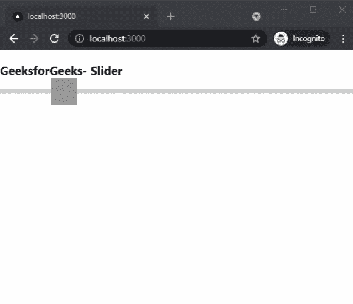

# 如何在 Next.js 中添加 Slider？

> 原文:[https://www.geeksforgeeks.org/how-to-add-slider-in-next-js/](https://www.geeksforgeeks.org/how-to-add-slider-in-next-js/)

在本文中，我们将学习如何在 NextJs 中添加 File Dropper。NextJS 是一个基于 React 的框架。它有能力为不同的平台开发漂亮的网络应用程序，如视窗、Linux 和 mac。动态路径的链接有助于有条件地呈现您的 NextJS 组件。

**方法:**要添加我们的滑块，我们将使用反应范围包。react-range 包帮助我们在应用程序的任何地方集成滑块。首先，我们将安装 react-range 软件包，然后我们将在主页上添加一个滑块。

**创建 NextJS 应用程序:**您可以使用以下命令创建一个新的 NextJs 项目:

```
npx create-next-app gfg
```

**安装所需的软件包:**现在我们将使用以下命令安装反应范围软件包:

```
npm i react-range
```

**项目结构:**会是这样的。


**添加滑块:**安装反应范围包后，我们可以很容易地在我们的应用程序中添加滑块。对于这个例子，我们将在我们的主页上添加一个滑块。

在 **index.js** 文件中添加以下内容:

## java 描述语言

```
import * as React from 'react';
import { Range } from 'react-range';

export default class Slider extends React.Component {
  state = { values: [50] };
  render() {
    return (
      <>
      <h3>GeeksforGeeks- Slider</h3>
      <Range
        step={0.1}
        min={0}
        max={100}
        values={this.state.values}
        onChange={(values) => this.setState({ values })}
        renderTrack={({ props, children }) => (
          <div
            {...props}
            style={{
              ...props.style,
              height: '6px',
              width: '100%',
              backgroundColor: '#ccc'
            }}
          >
            {children}
          </div>
        )}
        renderThumb={({ props }) => (
          <div
            {...props}
            style={{
              ...props.style,
              height: '42px',
              width: '42px',
              backgroundColor: '#999'
            }}
          />
        )}
      />
      </>
    );
  }
}
```

**解释:**首先在上面的例子中，我们是从已安装的包中导入我们的 Range 组件。之后，我们创建一个状态来存储起始值。然后，我们将添加我们的范围组件。在范围组件中，我们正在设置最小值、最大值、onChange 函数和当前值。

**运行应用的步骤:**在终端运行下面的命令运行应用。

```
npm run dev
```

### 输出:

