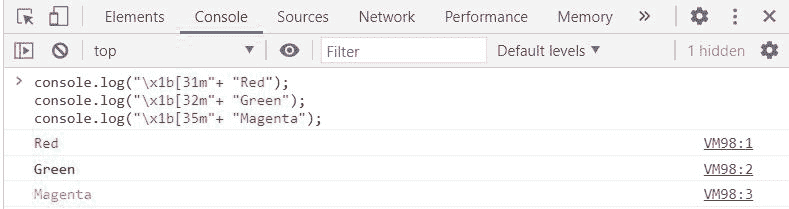
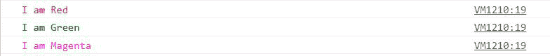

# 如何在 JavaScript 中在控制台中给文本添加特殊字符进行彩色打印？

> 原文:[https://www . geesforgeks . org/如何在 javascript 控制台中将特殊字符添加到文本中以打印颜色/](https://www.geeksforgeeks.org/how-to-add-special-characters-to-text-to-print-in-color-in-the-console-in-javascript/)

本文的目的是向文本中添加特殊字符，以便在 JavaScript 控制台中以彩色打印。

**方法:**ANSI 转义码有助于在控制台中更改/指定输出的颜色。控制台输出的颜色可以通过在实际文本前添加这些转义码来更改。

**语法:**

```
/*Codes for different Colors*/
black = "\x1b[30m"
red = "\x1b[31m"
green = "\x1b[32m"
yellow = "\x1b[33m"
blue = "\x1b[34m"
magenta = "\x1b[35m"
cyan = "\x1b[36m"
white = "\x1b[37m"
```

**示例:**

## java 描述语言

```
<script>
  console.log("\x1b[31m"+ "Red");
  console.log("\x1b[32m"+ "Green");
  console.log("\x1b[35m"+ "Magenta");
</script>
```

**输出:**



**注意:**上述任务可以通过在脚本中增加 ***自定义帮助器功能*** 来简化，该功能可以用控制台中要显示的颜色和数据来调用。

**示例:**以下是使用自定义助手函数执行*任务的 JavaScript 代码。*

## java 描述语言

```
<script>
function colorHelper(color,data)
{  

   /* function receives 2 arguments color and data*/
   const black = "\x1b[30m";  
   const red = "\x1b[31m";
   const green = "\x1b[32m";
   const yellow = "\x1b[33m";
   const blue = "\x1b[34m";
   const magenta = "\x1b[35m";
   const cyan = "\x1b[36m";
   const white = "\x1b[37m";
   const arr=[];

   /* Storing the color codes in Array */
   arr[0] = black;  
   arr[1] = red;
   arr[2] = green;
   arr[3] = yellow;
   arr[4] = blue;
   arr[5] = magenta;
   arr[6] = cyan;
   arr[7] = white;
   console.log(arr[color]+data);
}

/* colorHelper function called with color and data */
colorHelper(1,"I am Red");  
colorHelper(2,"I am Green");
colorHelper(5,"I am Magenta");
</script>
```

**输出:**

