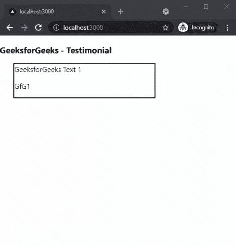

# 如何在 Next.js 中添加奖状？

> 原文:[https://www . geesforgeks . org/how-to-add-奖状-in-next-js/](https://www.geeksforgeeks.org/how-to-add-testimonials-in-next-js/)

在本文中，我们将学习如何在 NextJs 中添加证明。NextJS 是一个基于 React 的框架。它有能力为不同的平台开发漂亮的网络应用程序，如视窗、Linux 和 mac。动态路径的链接有助于有条件地呈现您的 NextJS 组件。

**方法:**要添加我们的推荐，我们将使用 react-推荐包。react-推荐书包帮助我们在应用程序的任何地方添加推荐书。首先，我们将安装 react-奖状包，然后我们将在主页上添加奖状。

**创建 NextJS 应用程序:**您可以使用以下命令创建一个新的 NextJs 项目:

```
npx create-next-app gfg
```

**安装所需的包:**现在我们将使用以下命令安装 react-奖状包:

```
npm i react-testimonial
```

**项目结构:**会是这样的。


**添加推荐书:**我们可以在安装了 react-推荐书包之后，在我们的 app 中轻松添加推荐书。对于这个例子，我们将把证明添加到我们的主页。

在 **index.js** 文件中添加以下内容:

## java 描述语言

```
import Testimonial from 'react-testimonial';
import React from 'react'

export default function index() {
  return (
    <div>
      <h3>GeeksforGeeks - Testimonial</h3>
      <Testimonial>
          <div>
              <div style={{width:'60%', 
                           border:'2px solid black',
                           marginLeft:'30px'}}>
                  <span>
                  GeeksforGeeks Text 1
                  </span>
                  <p>GfG1</p>
              </div>
          </div>
          <div style={{width:'60%', 
                       border:'2px solid black',
                       marginLeft:'30px'}}>
              <div>
                  <span>
                  GeeksforGeeks Text 2
                  </span>
                  <p>GfG2</p>
              </div>
          </div>
      </Testimonial>
    </div>
  )
}
```

**说明:**首先在上面的例子中，我们是从已安装的包中导入 perfect 组件。之后，我们将在我们的证明组件中添加我们的证明和作者姓名。

**运行应用的步骤:**在终端运行下面的命令运行应用。

```
npm run dev
```

### 输出:

