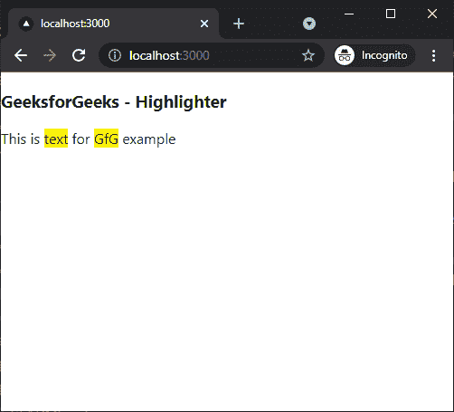

# 如何在 Next.js 中添加文字荧光笔？

> 原文:[https://www . geesforgeks . org/how-to-add-text-highlight-in-next-js/](https://www.geeksforgeeks.org/how-to-add-text-highlighter-in-next-js/)

在本文中，我们将学习如何在 NextJs 中添加文本荧光笔。NextJS 是一个基于 React 的框架。它有能力为不同的平台开发漂亮的网络应用程序，如视窗、Linux 和 mac。动态路径的链接有助于有条件地呈现您的 NextJS 组件。

**方法:**要添加我们的文本荧光笔，我们将使用反应-高亮-单词包。react-highlight-words 软件包可以帮助我们在应用程序的任何地方添加文本荧光笔。首先，我们将安装 react-highlight-words 软件包，然后我们将在主页上添加一个文本荧光笔。

**创建 NextJS 应用程序:**您可以使用以下命令创建一个新的 NextJs 项目:

```
npx create-next-app gfg
```

**安装所需的包:**现在我们将使用以下命令安装反应-拖放-文件包:

```
npm i react-highlight-words
```

**项目结构:**会是这样的。


**添加文件滴管:**安装反应-高亮-单词包后，我们可以在应用程序中轻松添加文本荧光笔。在这个例子中，我们将在主页上添加一个文本荧光笔。

在 **index.js** 文件中添加以下内容:

## java 描述语言

```
import Highlighter from "react-highlight-words";
import React from 'react'

export default function TextHighlighter() {
  return (
    <div>
      <h3>GeeksforGeeks - Highlighter</h3>
      <Highlighter
        highlightClassName="YourHighlightClass"
        searchWords={["Gfg", "text"]}
        autoEscape={true}
        textToHighlight="This is text for GfG example"
      />
    </div>
  )
}
```

**解释:**在上面的例子中，首先，我们从安装的包中导入我们的荧光笔组件。之后，我们在一个新的函数中使用荧光笔组件。我们可以在搜索单词道具中输入我们想要突出显示的单词，并在文本到高亮道具中输入我们的文本。

**运行应用的步骤:**在终端运行下面的命令运行应用。

```
npm run dev
```

### 输出:

