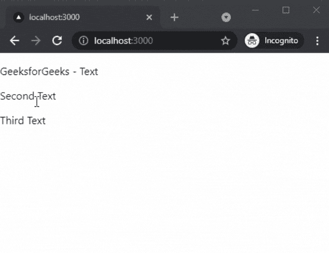

# 如何在 Next.js 中添加文本揭示？

> 原文:[https://www . geesforgeks . org/如何添加下一个 js 中的文本显示/](https://www.geeksforgeeks.org/how-to-add-text-reveals-in-next-js/)

在本文中，我们将学习如何在 NextJs 中添加文本揭示。NextJS 是一个基于 React 的框架。它有能力为不同的平台开发漂亮的网络应用程序，如视窗、Linux 和 mac。动态路径的链接有助于有条件地呈现您的 NextJS 组件。

**方法:**要添加我们的文本揭示，我们将使用反应-真棒-揭示包。反应-真棒-揭示包帮助我们整合不同类型的文本揭示。首先，我们将安装 react-awesome-show 软件包，然后我们将在主页上添加不同的文本。

**创建 NextJS 应用程序:**您可以使用以下命令创建一个新的 NextJs 项目:

```
npx create-next-app gfg
```

**安装所需的包:**现在我们将使用以下命令安装 react-awesome-show 包:

```
npm i react-awesome-reveal
```

**项目结构:**会是这样的。


**添加文字提示:**安装 react-awesome-show 包后，我们可以在应用的任何页面上轻松添加不同的文字提示。在这个例子中，我们将向我们的主页添加文本提示。

在 **index.js** 文件中添加以下内容:

## java 描述语言

```
import { Fade,Bounce,Flip } from "react-awesome-reveal";
import React from 'react'

export default function Reveal() {
  return (
    <div>
      <Fade duration='10000'>
        <p>GeeksforGeeks - Text</p>
      </Fade>
      <Flip>
        <p>Second Text</p>
      </Flip>
      <Bounce>
        <p>Third Text</p>
      </Bounce>
    </div>
  )
}
```

**说明:**首先在上面的例子中，我们从已安装的包中导入了不同的文本显示组件，如 Fade、Bounce 和 Flip。然后我们使用这个组件并在其中设置文本。您也可以使用 duration 属性为每个动画设置持续时间。

**运行应用的步骤:**在终端运行下面的命令运行应用。

```
npm run dev
```

### 输出:

