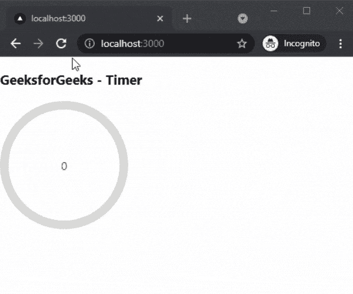

# 如何在 Next.js 中添加 Timer？

> 原文:[https://www.geeksforgeeks.org/how-to-add-timer-in-next-js/](https://www.geeksforgeeks.org/how-to-add-timer-in-next-js/)

在本文中，我们将学习如何在 NextJs 中添加 Timer。NextJS 是一个基于 React 的框架。它有能力为不同的平台开发漂亮的网络应用程序，如视窗、Linux 和 mac。动态路径的链接有助于有条件地呈现您的 NextJS 组件。

**方法:**要添加我们的计时器，我们将使用反应倒计时循环计时器包。react-倒计时-循环计时器包帮助我们集成不同类型的计时器。所以首先，我们将安装反应-倒计时-循环-计时器包，然后我们将在我们的主页上添加计时器。

**创建 NextJS 应用程序:**您可以使用以下命令创建一个新的 NextJs 项目:

```
npx create-next-app gfg
```

**安装所需的包:**现在我们将使用以下命令安装反应-倒计时-循环-计时器包:

```
npm i react-countdown-circle-timer
```

**项目结构:**会是这样的。


**添加定时器:**安装反应-倒计时-圆圈-定时器包后，我们可以很容易地在我们的应用程序中添加定时器。对于这个例子，我们将添加计时器到我们的主页。

在 **index.js** 文件中添加以下内容:

## java 描述语言

```
import { CountdownCircleTimer } from 
    'react-countdown-circle-timer'

export default function Timer(){
  return (
    <div>
      <h3>GeeksforGeeks - Timer</h3>
      <CountdownCircleTimer
        isPlaying
        duration={10}
        colors={[
          ['#004777', 0.33],
          ['#F7B801', 0.33],
          ['#A30000', 0.33],
        ]}
      >
        {({ remainingTime }) => remainingTime}
      </CountdownCircleTimer>
    </div>

  )
}
```

**解释:**在上面的例子中，首先，我们从已安装的包中导入我们的 CountdownCircleTimer 组件。之后，我们使用组件并设置初始属性，如 isPlaying、持续时间和颜色。然后我们显示剩余时间。

**运行应用的步骤:**在终端运行下面的命令运行应用。

```
npm run dev
```

### 输出:

