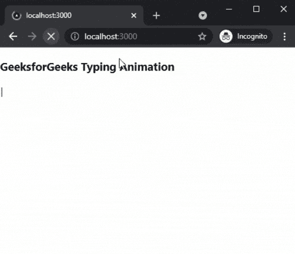

# 如何在 Next.js 中添加 Typewriter 效果？

> 原文:[https://www . geesforgeks . org/如何添加打字机-下一个效果-js/](https://www.geeksforgeeks.org/how-to-add-typewriter-effect-in-next-js/)

在本文中，我们将学习如何在 NextJs 中添加打字机效果。NextJS 是一个基于 React 的框架。它有能力为不同的平台开发漂亮的网络应用程序，如视窗、Linux 和 mac。动态路径的链接有助于有条件地呈现您的 NextJS 组件。

**方法:**要添加我们的打字机效果，我们将使用打字机效果包。打字机效果包帮助我们在应用程序的任何地方添加打字机效果。首先，我们将安装打字机效果包，然后我们将在主页上添加效果。

**创建 NextJS 应用程序:**您可以使用以下命令创建一个新的 NextJs 项目:

```
npx create-next-app gfg
```

**安装所需的包:**现在我们将使用以下命令安装打字机效果包:

```
npm i typewriter-effect
```

**项目结构:**会是这样的。


**添加效果:**安装好打字机效果包后，我们可以在 app 中轻松添加打字机效果。对于这个例子，我们将把这个效果添加到我们的主页上。

在 **index.js** 文件中添加以下内容:

## java 描述语言

```
import React from "react";
import Typewriter from 'typewriter-effect';

export default function TypingEffect() {
  return (
    <div>
      <h3>GeeksforGeeks Typing Animation</h3>
      <Typewriter
        onInit={(typewriter) => {
          typewriter.typeString('Hello World!')
            .callFunction(() => {
              console.log('String typed out!');
            })
            .pauseFor(2500)
            .deleteAll()
            .callFunction(() => {
              console.log('All strings were deleted');
            })
            .start();
        }}
      />
    </div>
  );
}
```

**说明:**首先在上面的例子中，我们是从已安装的包中导入 Typewriter 组件。之后，我们将添加暂停计时、删除所有功能，以及我们想要在打字机组件中添加文本的文本。

**运行应用的步骤:**在终端运行下面的命令运行应用。

```
npm run dev
```

### 输出:

