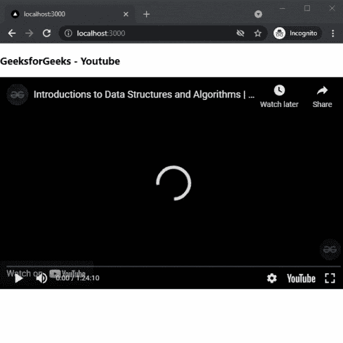

# 如何在 Next.js 中添加 Youtube 视频？

> 原文:[https://www . geesforgeks . org/how-add-YouTube-videos-in-next-js/](https://www.geeksforgeeks.org/how-to-add-youtube-videos-in-next-js/)

在本文中，我们将学习如何在 NextJs 中添加 Youtube 视频。NextJS 是一个基于 React 的框架。它有能力为不同的平台开发漂亮的网络应用程序，如视窗、Linux 和 mac。动态路径的链接有助于有条件地呈现您的 NextJS 组件。

**方法:**要添加我们的 Youtube 视频，我们将使用 react-youtube 包。react-youtube 包帮助我们在应用程序的任何地方添加 youtube 视频。首先，我们将安装 react-youtube 包，然后我们将在主页上添加一个 youtube 视频。

**创建 NextJS 应用程序:**您可以使用以下命令创建一个新的 NextJs 项目:

```
npx create-next-app gfg
```

**安装所需的包:**现在我们将使用以下命令安装 react-youtube 包:

```
npm i react-youtube
```

**项目结构:**会是这样的。


**添加 Youtube 视频:**安装 react-youtube 包后，我们可以在应用程序中轻松添加 Youtube 视频。在这个例子中，我们将在主页上添加一个文本荧光笔。

在 **index.js** 文件中添加以下内容:

## java 描述语言

```
import React from "react";
import YouTube from "react-youtube";

export default class YoutubeVideo 
extends React.Component {
  render() {
    const opts = {
      height: "390",
      width: "640",
      playerVars: {
        autoplay: 1,
      },
    };

    return (
      <div>
        <h3>GeeksforGeeks - Youtube</h3>
        <YouTube videoId="sTnm5jvjgjM" 
            opts={opts} onReady={this._onReady} />
      </div>
    );
  }

  _onReady(event) {
    event.target.pauseVideo();
  }
}
```

**说明:**首先在上面的例子中，我们是从已安装的包中导入 Youtube 组件。之后，我们将创建一个新的常量变量来存储视频播放器的设置。然后，我们将我们的视频标识和选项添加到我们的 Youtube 组件中。你可以在 youtube 视频链接中找到视频 Id。

**运行应用的步骤:**在终端运行下面的命令运行应用。

```
npm run dev
```

### 输出:

