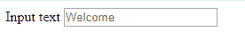

# 如何使用 JavaScript 自动调整输入字段的宽度？

> 原文:[https://www . geesforgeks . org/如何使用 javascript 自动调整输入字段的宽度/](https://www.geeksforgeeks.org/how-to-adjust-the-width-of-input-field-automatically-using-javascript/)

**HTML <输入>元素**用于为基于网络的表单创建交互控件，以便接受来自用户的数据。<输入>元素是所有 HTML 中最强大和复杂的元素之一，因为输入类型和属性的组合数量庞大。HTML <输入>宽度属性用于指定元素的宽度。

动态增加<input>元素的宽度。
**进场 1:**

*   当用户按下任何键时，onkeypress 事件发生。
*   选择元素的宽度属性。
*   使它等于输入字段值的长度乘以这个值

```
<input type="text" onkeypress="myFunction()"> 
```

在这里，我们选择<input>元素，并添加一个方法，当按下一个键时会发生这种情况。此方法动态选择并更新 width 属性值。

**HTML 代码:**

```
<!DOCTYPE html> 
<html> 
<head> 
    <title> How to adjust width of 
an input field to its input?</title> 
</head> 
<body> 
    <form method="post" action="">
        <label for="username">Input text</label>
        <input type="text" id="textbox" 
        name="textbox" placeholder="Welcome"
        onkeypress="this.style.width = 
            ((this.value.length + 1) * 8) + 'px';"
        id="input"/>
    </form>
</body> 
</html>                 
```

您还可以编写一个 JavaScript 函数，在输入更改时检查字符串的长度，然后根据字符数*字符宽度调整输入的宽度。

**替代 JavaScript 代码:**

```
$('input').css('width', ((
  input.getAttribute('placeholder').length + 1) * 8) + 'px');
$("input").focusout(function() {
    if (this.value.length > 0) {
        this.style.width = 
          ((this.value.length + 1) * 8) + 'px';
    } else {
        this.style.width = 
          ((this.getAttribute('placeholder').length + 1) * 8)
        + 'px';
    }
});
```

**输出:**


**方法 2:** 结合使用 jQuery keypress()事件和 String.fromCharCode(即哪个)来获取被按下的字符。因此，我们可以计算输入元素的宽度。

**jQuery Code:**

```
$('input[type="text"]').keypress(function(e) {
    if (e.which !== 0 && e.charCode !== 0) { 

        // Only characters
        var c = String.fromCharCode(e.keyCode|e.charCode);
        $span = $(this).siblings('span').first();

        // The hidden span takes 
        $span.text($(this).val() + c) ; 

        // The value of the input
        $inputSize = $span.width() ; 

        // Apply width of the span to the input
        $(this).css("width", $inputSize) ;
     }
}) ;
```

**输出:**

<video class="wp-video-shortcode" id="video-388620-1" width="640" height="360" preload="metadata" controls=""><source type="video/webm" src="https://media.geeksforgeeks.org/wp-content/uploads/20200323213716/output_gfg.webm?_=1">[https://media.geeksforgeeks.org/wp-content/uploads/20200323213716/output_gfg.webm](https://media.geeksforgeeks.org/wp-content/uploads/20200323213716/output_gfg.webm)</video>

**浏览器兼容性:**

*   铬:是的
*   火狐:是的(63.0)
*   边缘:是的
*   互联网浏览器:是的
*   歌剧:是的
*   游猎:是的