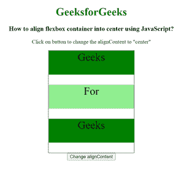
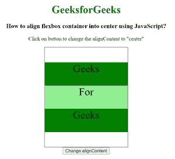

# 如何用 JavaScript 将柔性盒容器居中对齐？

> 原文:[https://www . geeksforgeeks . org/how-align-flex box-container-in-center-use-JavaScript/](https://www.geeksforgeeks.org/how-to-align-flexbox-container-into-center-using-javascript/)

在本文中，我们将使用 JavaScript 设置内容的对齐方式。DOM Style alignContent 属性用于在灵活容器的项目没有使用横轴上的所有可用空间时对齐它们。

**语法:**

```html
object.style.alignContent = "center"
```

**属性值:**

*   **中心:**用于将文本内容放入容器的中心。

**示例:**

## 超文本标记语言

```html
<!DOCTYPE html>
<html>

<head>
    <title>
        How to align flexbox container
        into center using JavaScript?
    </title>
</head>

<head>
    <style>
        .main {
            width: 250px;
            height: 300px;
            border: 1px solid;
            display: flex;
            flex-flow: row wrap;
        }

        .main div {
            width: 250px;
            height: 70px;
            font-size: 2rem;
            text-align: center;
        }
    </style>
</head>

<body>
    <center>
        <h1 style="color: green">
            GeeksforGeeks
        </h1>

        <h3>
            How to align flexbox container
            into center using JavaScript?
        </h3>

        <p>
            Click on button to change the
            alignContent to "center"
        </p>

        <div class="main">
            <div style="background-color:green;">
                Geeks
            </div>
            <div style="background-color:lightgreen;">
                For
            </div>
            <div style="background-color:green;">
                Geeks
            </div>
        </div>

        <button onclick="changeAlign()">
            Change alignContent
        </button>
    </center>

    <script>
        function changeAlign() {
            document.querySelector('.main')
                .style.alignContent = "center";
        } 
    </script>
</body>

</html>
```

**输出:**

**点击按钮前:**



**点击按钮后:**

