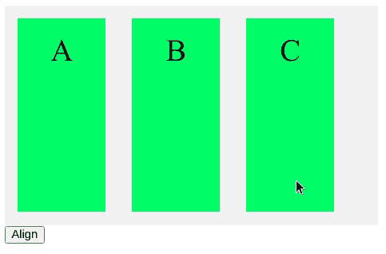
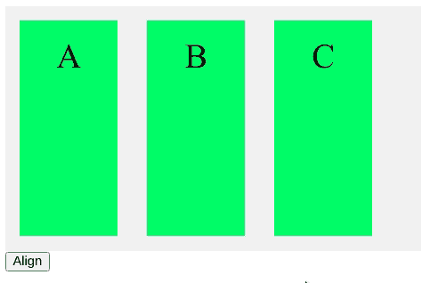

# 如何用 JavaScript 对齐 flex 容器中的项目？

> 原文:[https://www . geeksforgeeks . org/如何用 javascript 对齐 flex 容器中的项目/](https://www.geeksforgeeks.org/how-to-align-items-in-a-flex-container-with-javascript/)

在 CSS 中， **align-items** 属性用于对齐 flex 容器中的元素。通过使用选择器方法选择特定元素，然后使用**对齐方式**属性设置对齐方式，可以使用 JavaScript 类似地实现这一点。这在需要动态设置容器中项目的对齐方式的情况下非常有用。

**语法:**

```
document.getElementById("elementId")
.style.alignItems="flex-start | flex-end | center"
```

下面的例子演示了如何使用 JavaScript 对齐项目。

**示例 1:** 在此示例中，项目将与容器的起点对齐。

## 超文本标记语言

```
<!DOCTYPE html>
<html>
  <head>
    <style>
      #flex-container {
        display: flex;
        background-color: #f1f1f1;
        width: 50%;
        height: 250px;
      }
      #flex-container > div {
        background-color: rgb(33, 246, 107);
        color: "#000000";
        width: 100px;
        margin: 15px;
        text-align: center;
        line-height: 75px;
        font-size: 35px;
      }
    </style>
  </head>
  <body>
    <div id="flex-container">
      <div>A</div>
      <div>B</div>
      <div>C</div>
    </div>
    <button onclick="align()">Align</button>
    <script>
      function align() {

        // Set the required alignment
        document.getElementById("flex-container")
                   .style.alignItems = "flex-start";
      }
    </script>
  </body>
</html>
```

**输出:**



**示例 2:** 在此示例中，项目将与容器的末端对齐。

## 超文本标记语言

```
<!DOCTYPE html>
<html>
  <head>
    <style>
      #flex-container {
        display: flex;
        background-color: #f1f1f1;
        width: 50%;
        height: 250px;
      }
      #flex-container > div {
        background-color: rgb(33, 246, 107);
        color: "#000000";
        width: 100px;
        margin: 15px;
        text-align: center;
        line-height: 75px;
        font-size: 35px;
      }
    </style>
  </head>
  <body>
    <div id="flex-container">
      <div>A</div>
      <div>B</div>
      <div>C</div>
    </div>
    <button onclick="align()">Align</button>
    <script>
      function align() {

        // Set the required alignment
        document.getElementById("flex-container")
                  .style.alignItems = "flex-end";
      }
    </script>
  </body>
</html>
```

**输出:**


**示例 3:** 在此示例中，项目将与容器的中心对齐。

## 超文本标记语言

```
<!DOCTYPE html>
<html>
  <head>
    <style>
      #flex-container {
        display: flex;
        background-color: #f1f1f1;
        width: 50%;
        height: 250px;
      }
      #flex-container > div {
        background-color: rgb(33, 246, 107);
        color: "#000000";
        width: 100px;
        margin: 15px;
        text-align: center;
        line-height: 75px;
        font-size: 35px;
      }
    </style>
  </head>
  <body>
    <div id="flex-container">
      <div>A</div>
      <div>B</div>
      <div>C</div>
    </div>
    <button onclick="align()">Align</button>
    <script>
      function align() {

        // Set the required alignment
        document.getElementById("flex-container")
                  .style.alignItems = "center";
      }
    </script>
  </body>
</html>
```

**输出:**

