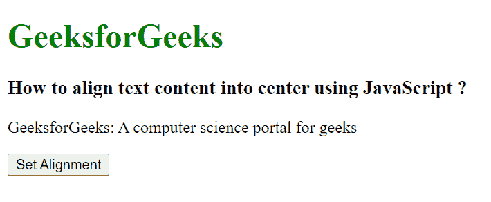
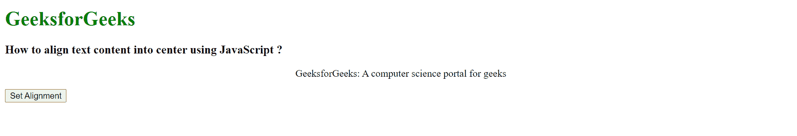

# 如何使用 JavaScript 将文本内容居中对齐？

> 原文:[https://www . geesforgeks . org/如何使用 javascript 将文本内容居中对齐/](https://www.geeksforgeeks.org/how-to-align-text-content-into-center-using-javascript/)

在本文中，我们将使用 JavaScript 将文本内容居中对齐。我们使用 HTML DOM 样式的文本对齐属性来设置文本的对齐方式。

**语法:**

```html
object.style.textAlign = "center"
```

上述语法动态地将文本对齐设置为居中。

**示例:**

## 超文本标记语言

```html
<!DOCTYPE html>
<html>

<head>
    <title>
        How to align text content into
        center using JavaScript ?
    </title>
</head>

<body>
    <h1 style="color: green;">GeeksforGeeks</h1>

    <h3>
        How to align text content into
        center using JavaScript ?
    </h3>

    <p id="content">
        GeeksforGeeks: A computer
        science portal for geeks
    </p>

    <button onclick="myFunction();">
        Set Alignment
    </button>

    <script type="text/javascript">

        function myFunction() {
            let txt = document.getElementById("content");
            txt.style.textAlign = "center";
        }
    </script>
</body>

</html>
```

**输出:**

**按钮点击前:**



**按钮点击后:**



**支持的浏览器:**

*   谷歌 Chrome
*   微软公司出品的 web 浏览器
*   Mozilla Firefox
*   歌剧
*   旅行队