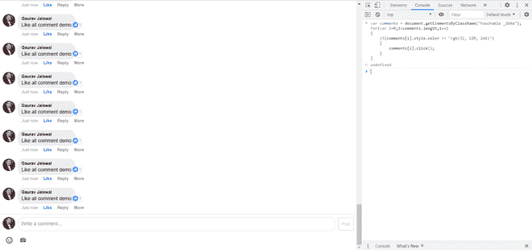

# 如何用 JavaScript 自动喜欢一个 facebook 帖子上的所有评论？

> 原文:[https://www . geesforgeks . org/how-auto-like-all-comments-on-a-Facebook-post-use-JavaScript/](https://www.geeksforgeeks.org/how-to-auto-like-all-the-comments-on-a-facebook-post-using-javascript/)

在本文中，我们将学习如何自动喜欢脸书帖子上的所有评论。很多时候我们想喜欢朋友在我们的帖子上或者其他任何人的帖子上的所有评论，所以这个脚本通过自动喜欢帖子上的所有评论来帮助我们节省时间和精力。

**进场:**

1.  制作一个可变注释，指向帖子上所有注释的数组。
2.  运行循环以迭代所有注释。
3.  现在我们检查一下评论是不是已经有人喜欢了。
4.  然后点击评论的相似按钮。

**以下是步骤:**

*   使用**m.facebook.com**进入脸书页面
*   登录并打开任何帖子。
*   在 Chrome 中按 Ctrl+Shift+I 打开开发者模式
*   导航到控制台。
*   现在，运行下面的脚本。

    ```
    var comments =document.getElementsByClassName("touchable _2b0a");
    for(var i=0;i<comments.length;i++)
    {
        if(comments[i].style.color != "rgb(32, 120, 244)")
        {
            comments[i].click();
        }
    }
    ```

**输出:**



输出

**注意:**请确保有稳定的互联网连接可用，以便脚本顺利运行。还要确保使用**m.facebook.com**而不是**www.facebook.com**访问 facebook，因为此脚本仅适用于移动版 facebook。

> 本教程仅用于教育目的，请不要用它来打扰任何人或任何不道德的方式。