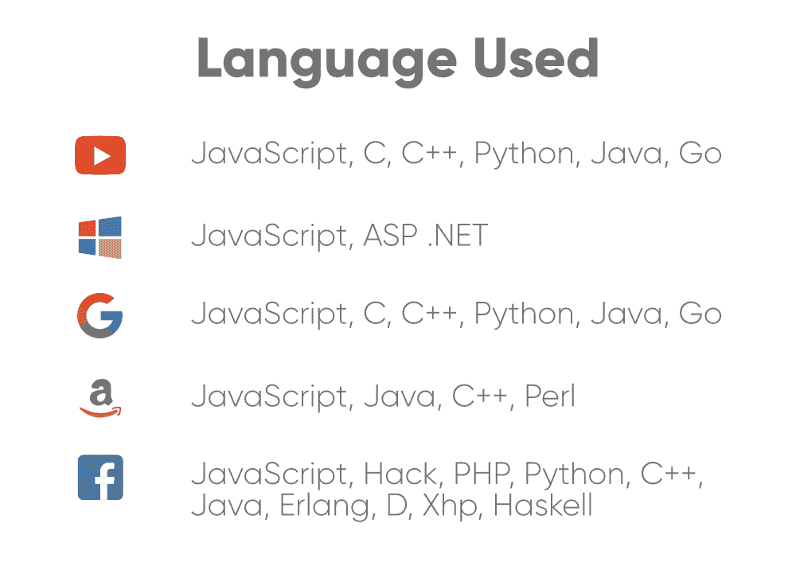
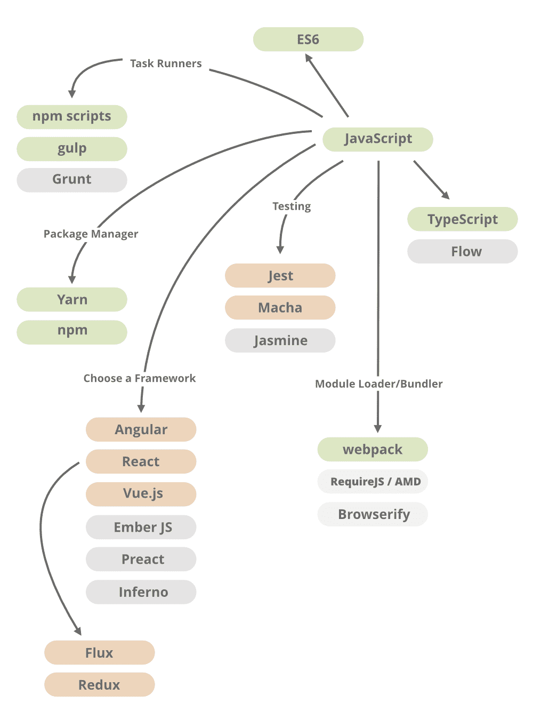
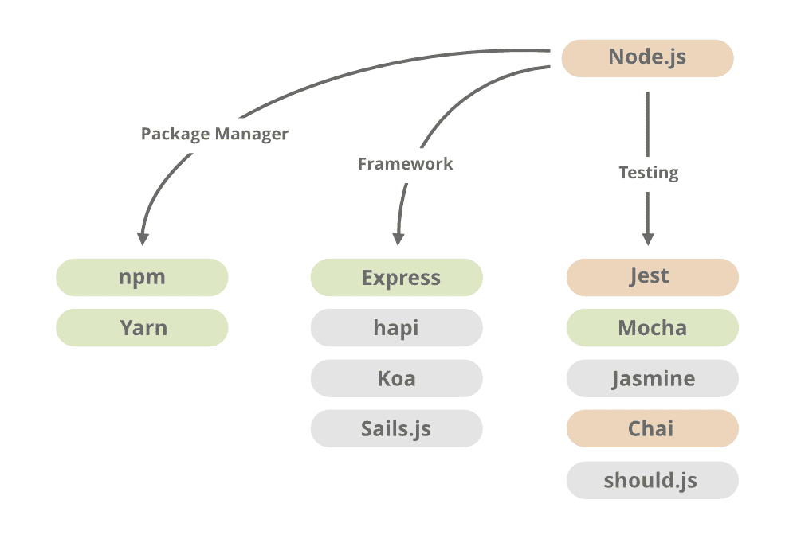

# 如何成为一名 JavaScript 开发者？

> 原文:[https://www . geesforgeks . org/如何成为一名 javascript 开发人员/](https://www.geeksforgeeks.org/how-to-become-a-javascript-developer/)

*Javascript 无处不在*。如果我们谈论任何小的初创公司或大公司，他们中的大多数都在任何类型的网站或应用程序上工作，总是在寻找具有 Javascript 知识的人。数以百万计的网页都是建立在 JavaScript 上的，至少目前还没有任何进展。这种语言需求量很大，你可以在[领英](https://www.linkedin.com/jobs/)上查看你所在地区的招聘信息。一边是 HTML 和 CSS 为页面提供样式，另一边是 JavaScript，这让页面变得生动起来。

[Javascript](https://www.geeksforgeeks.org/javascript-tutorial/) 被广泛使用，它不仅仅局限于你的网络浏览器，也广泛应用于服务器端。你可以在这里查看[95%的网站使用 JavaScript。](https://w3techs.com/technologies/details/cp-javascript/all/all)根据 [**栈溢出开发者调查 2019**](https://insights.stackoverflow.com/survey/2019) javascript 也是#1 编程语言，所以如果你想走选择 Javascript 的道路，成为一个 Javascript 忍者，那么这不是一个愚蠢的决定。

现在，当你转向这种语言时，你可能面临的问题是从哪里开始，你应该选择哪些框架，你需要涵盖的东西，书籍，教程，博客或者你应该走哪条路。放松，深呼吸，我们会一一告诉你一切，给你一个完整的路线图，让你成为一个 Javascript 开发者。

**1。基本基础和异步概念:**如果你是初学者，你应该首先关注核心概念或基本基础，如 Let，var 和 const，If-else 语句，循环，函数，映射，过滤和减少，表达式和运算，数字，字符串，数组和对象，ES5，ES6。在继续前进之前，你应该了解所有的基本概念。如何操作 DOM，如何使用事件以及 Javascript 中的所有其他基本内容。当你清楚了它的基本概念后，了解 javascript 的异步行为。还要了解原型、强制、宿主、范围、回调、承诺、闭包、高阶函数，所有这些在这个 javascript 中是如何工作的。

**2。以算法挑战为例:**当你申请 JavaScript 开发人员的工作时，你会在面试中遇到一些需要解决的算法挑战。会有一些 ***代码测试*** 或者很少有公司更喜欢发送在线测试或项目库，或者他们可以要求在公司执行一些实时代码测试。因此，我们强烈建议，一旦你完成了基本概念，解决一些算法挑战，测试你的知识，也检查你的代码做一些操作或采取一些其他的输入例子。当您尝试使用代码时，检查输出有何不同。

**3。客户端框架和库:**当涉及到应用程序的前端部分时，有这么多的 Javascript 框架和库，这给开发人员在所有这些框架和库中选择正确的一个造成了混乱。牢记两件事*学习曲线*从*工作角度*我们强烈建议选择 ***Vue.js 或 ReactJs 或 AngularJS*** 。这些客户端框架和库在就业市场上需求量很大，大多数公司都在使用它来构建应用程序。可以在 [**谷歌趋势**](https://trends.google.com/trends/explore?geo=US&q=angular, react, vue) 上查看这些框架的受欢迎程度和对比情况，也可以查看 [Angular vs React](https://www.geeksforgeeks.org/angular-vs-reactjs-which-one-is-most-in-demand-frontend-development-framework-in-2019/) 的链接，进一步帮助选择合适的学习框架。

**4。服务器端框架和环境:** JavaScript 不仅限于浏览器，你也可以在浏览器外运行， [NodeJS](https://www.geeksforgeeks.org/introduction-to-nodejs/) 是允许你在浏览器外运行 JavaScript 的技术。 **NodeJs** 是一个极其强大的运行时环境，它使 JavaScript 成为一种后端编程语言，近年来开发人员更喜欢将 [NodeJS](https://www.geeksforgeeks.org/introduction-to-nodejs/) 与 [ExpressJS](https://www.geeksforgeeks.org/introduction-to-express/) 一起使用，后者是 Node 的框架，广泛用于构建后端 API。因此，我们强烈建议您学习这两种方法。

**5。数据库:**在实现您的 javascript 应用程序时，您应该至少了解一个数据库来连接您的应用程序以及存储和操作数据。您可以使用任何 SQL 或 NoSQL 数据库。一些选项是 MongoDB、PostgreSQL、MySQL、CouchDB、Redis。因此，请确保您至少对一个数据库有基本的了解。

**6。任务运行器&模块捆绑器:**任务运行器有助于连接多个 js 文件，并且每次某个文件更改时都会运行。[大口](https://gulpjs.com/)和[咕噜](https://gruntjs.com)这两个任务跑者大部分被开发者使用。如果我们谈论模块捆绑器，那么它们负责在执行之前将 Javascript 文件缝合到一个文件中，这将提高网站性能。[网络包](https://webpack.js.org/)和[浏览器](http://browserify.org/)这两个是大多数开发人员的首选，所以我们建议您选择上面的任务运行器和模块捆绑器。

**7。OOP 和函数式编程:**JavaScript 中的面向对象编程不像在其他编程语言中那样工作。它的概念是不同的，它会造成混乱，因为 JavaScript 是基于原型的，而不是基于类的。请参考链接[面向对象 Javascript](https://developer.mozilla.org/en-US/docs/Learn/JavaScript/Objects/Object-oriented_JS) 以更好地理解它。此外，了解函数式编程，并了解它与面向对象编程有何不同。查看[函数式编程](https://medium.com/javascript-scene/master-the-javascript-interview-what-is-functional-programming-7f218c68b3a0)和[函数式编程介绍](https://opensource.com/article/17/6/functional-javascript)链接，更好的理解 Javascript。

**8。设计模式:**设计模式有助于使应用程序具有可伸缩性和可维护性，也使开发人员更容易工作，因此学习在 Javascript 中使用一些常见的设计模式，如 Module、Prototype、Observer、Singleton，还学习如何使用它们来解决不同类型的问题。可以查看 JS 中的[设计模式链接了解本主题。](https://github.com/fbeline/Design-Patterns-JS)

**9。部署和托管:**一旦你完成了所有的概念，你可以创建自己的项目，但故事并没有到此结束。您还需要将您的项目部署在一个实时服务器上，这将有助于您获得一份工作，制作一个投资组合并获得您自己的知识。 *GitHub Pages，Heroku，Netlify，数字海洋，AWS，Firebase* 。 ***Heroku*** 和 ***Netlify*** 超级容易访问，所以你可以选择其中任何一个。

**10。其他材料**

*   测试库:Jest、摩卡、茉莉、西恩、柴、酵素
*   包装经理:NPM 和纱。
*   浏览器和开发工具:Chrome、火狐、微软边缘及其开发或调试工具。
*   版本控制
*   文字编辑器
*   [HTML](https://www.geeksforgeeks.org/html-tutorials/) 和 [CSS](https://www.geeksforgeeks.org/css-tutorials/) 的知识

下面是 Javascript 前端和后端部分的清晰图片。

**客户端:**

图片来源:谷歌

**服务器端:**

图片来源:谷歌

**也可以看下面的东西:**

*   [雄辩的 Javascript](http://eloquentjavascript.net/)
*   [你不知道 JS](https://github.com/getify/You-Dont-Know-JS)
*   [MDN](https://developer.mozilla.org/en-US/docs/Web/JavaScript)

**一些最好的 Youtube 视频:**

*   [趣味趣味功能](https://www.youtube.com/channel/UCO1cgjhGzsSYb1rsB4bFe4Q)
*   [学习代码学院](https://www.youtube.com/channel/UCVTlvUkGslCV_h-nSAId8Sw)
*   [新波士顿](https://www.youtube.com/channel/UCJbPGzawDH1njbqV-D5HqKw)

**时事通讯:**

*   [JSK 日报](https://javascriptkicks.com/)
*   [Javascript 周刊](https://javascriptweekly.com/)
*   [超赞的 Javascript](https://js.libhunt.com/newsletter)

**专家跟随:**

*   [凯尔辛普森](https://github.com/getify)
*   [埃里克·埃利奥特](https://medium.com/@_ericelliott)
*   [Addy Osmani](https://twitter.com/addyosmani)
*   [保罗爱尔兰](http://Paul Irish)
*   [阿曼莎](https://twitter.com/umaar)
*   [MPJ](https://twitter.com/mpjme)
*   [西森林](http://Wes Bos)
*   [JavaScriptKicks](https://twitter.com/JavaScriptKicks) (组织)
*   [_ 发展博客](https://twitter.com/_devblogs)(组织)

**面试问题:**

*   [36 个基本 JavaScript 面试问题](https://www.toptal.com/javascript/interview-questions)
*   [21 个基本 JavaScript 面试问题](https://www.codementor.io/nihantanu/21-essential-javascript-tech-interview-practice-questions-answers-du107p62z)
*   [10 个面试问题每个 javascript 开发者都必须知道](http://10 interview questions every javascript developer must know)

**参考:**

*   [全栈 JavaScript 路线图](https://github.com/fChristenson/js-roadmap/blob/master/README.md)
*   [卡姆兰·艾哈迈德·吉图布链接](https://github.com/kamranahmedse/developer-roadmap)