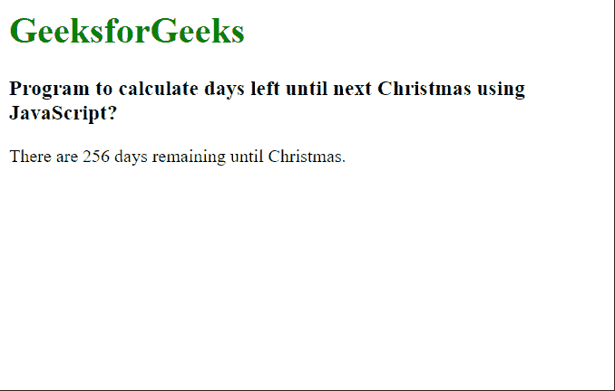

# 如何用 JavaScript 计算到下一个圣诞节还有多少天？

> 原文:[https://www . geeksforgeeks . org/如何使用 javascript 计算到下一个圣诞节的剩余天数/](https://www.geeksforgeeks.org/how-to-calculate-days-left-until-next-christmas-using-javascript/)

在本文中，我们将学习如何使用 JavaScript 计算到下一个圣诞节还有多少天。圣诞节标志着基督的诞生，每年的 12 月 25 日是全球数百万人庆祝的宗教和文化节。

**方法:**为了在 JavaScript 中计算两个日期之间的天数，必须使用 Date 对象。我们使用 **[getFullYear()](https://www.geeksforgeeks.org/javascript-date-getfullyear-method/)** 方法找出今年圣诞节的年份值。然后，我们通过检查月份是否为 12 月，日期是否大于 25 日，来检查当前日期是否已经过了圣诞节。 **[getMonth()](https://www.geeksforgeeks.org/javascript-date-getmonth-method/)** 方法得到月份， **[getDate](https://www.geeksforgeeks.org/javascript-date-getdate-method/) ()** 方法得到给定时间的日期值。

如果这个条件得到满足，我们会在之前发现的圣诞年的基础上再增加一年，从而将下一年的圣诞节提前。然后，我们创建下一个圣诞节的最终日期值。

我们可以使用 **[getTime()](https://www.geeksforgeeks.org/javascript-date-gettime-method/)** 函数来获取以毫秒为单位的两个日期值。在转换之后，我们用前一个减去后一个，得到以毫秒为单位的差值。最终天数是通过将两个日期之间的差异(以毫秒为单位)除以一天中的毫秒数获得的。

**语法:**

```
let today = new Date();
let christmasYear = today.getFullYear();

if (today.getMonth() == 11 && today.getDate() > 25) {
  christmasYear = christmasYear + 1;
}

let christmasDate = new Date(christmasYear, 11, 25);
let dayMilliseconds = 1000 * 60 * 60 * 24;

let remainingDays = Math.ceil(
  (christmasDate.getTime() - today.getTime()) /
   (dayMilliseconds)
);
```

**示例:**

## 超文本标记语言

```
<html>
<body>
  <h1 style="color: green;">
    GeeksforGeeks
  </h1>
  <h3>
    Program to calculate days left until
    next Christmas using JavaScript?
  </h3>
  <script>
    // Get the current date
    let today = new Date();

    // Get the year of the current date
    let christmasYear = today.getFullYear();

    // Check if the current date is
    // already past by checking if the month
    // is December and the current day
    // is greater than 25
    if (today.getMonth() == 11 &&
        today.getDate() > 25) {

      // Add an year so that the next
      // Christmas date could be used
      christmasYear = christmasYear + 1;
    }

    // Get the date of the next Christmas
    let christmasDate = 
        new Date(christmasYear, 11, 25);

    // Get the number of milliseconds in 1 day
    let dayMilliseconds =
        1000 * 60 * 60 * 24;

    // Get the remaining amount of days
    let remainingDays = Math.ceil(
      (christmasDate.getTime() - today.getTime()) /
      (dayMilliseconds)
    );

    // Write it to the page
    document.write("There are " + remainingDays +
                   " days remaining until Christmas.");
  </script>
</body>
</html>
```

**输出:**

