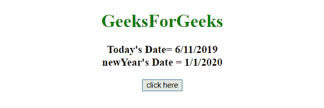
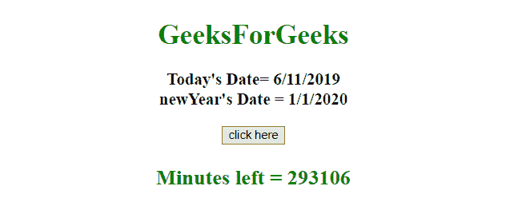
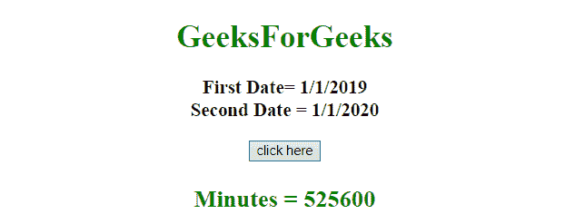

# 如何在 JavaScript 中计算两个日期之间的分钟数？

> 原文:[https://www . geesforgeks . org/如何用 javascript 计算两个日期之间的分钟数/](https://www.geeksforgeeks.org/how-to-calculate-minutes-between-two-dates-in-javascript/)

给定两个日期，任务是使用 JavaScript 获取它们之间的分钟数。

**进场:**

*   初始化两个日期对象。
*   从新日期减去旧日期。它将给出从 1970 年 1 月 1 日开始的毫秒数。
*   将毫秒转换为分钟。

**示例 1:** 本示例使用当前日期和下一个新年日期来获得以分钟为单位的日期差异。

```
<!DOCTYPE HTML> 
<html> 
    <head> 
        <title> 
            How to get the minutes between
            two dates in JavaScript ?
        </title>
    </head> 

    <body style = "text-align:center;"> 

        <h1 style = "color:green;" > 
            GeeksForGeeks 
        </h1>

        <p id = "GFG_UP" style = 
            "font-size: 19px; font-weight: bold;">
        </p>

        <button onClick = "GFG_Fun()">
            click here
        </button>

        <p id = "GFG_DOWN" style = 
            "color: green; font-size: 24px; font-weight: bold;">
        </p>

        <!-- Script to calculate difference between two dates -->
        <script>
            var up = document.getElementById('GFG_UP');
            var down = document.getElementById('GFG_DOWN');

            // Declare dates
            var today = new Date();
            var newYear = new Date("01-01-2020");

            // Display the dates
            up.innerHTML = "Today's Date= "+ today.toLocaleDateString()
                + "<br> newYear's Date = " + newYear.toLocaleDateString();

            // Function to calculate difference
            // between two dates
            function GFG_Fun() {
                var dif = (newYear - today);
                var dif = Math.round((dif/1000)/60);
                down.innerHTML = "Minutes left = " + dif;
            }
        </script> 
    </body> 
</html>
```

**输出:**

*   **点击按钮前:**
    
*   **点击按钮后:**
    

**示例 2:** 本示例使用 2019 年新年和 2020 年新年的日期来获得以分钟为单位的差异。

```
<!DOCTYPE HTML> 
<html> 
    <head> 
        <title> 
            How to get the minutes between
            two dates in JavaScript ?
        </title>
    </head> 

    <body style = "text-align:center;"> 

        <h1 style = "color:green;" > 
            GeeksForGeeks 
        </h1>

        <p id = "GFG_UP" style = 
            "font-size: 19px; font-weight: bold;">
        </p>

        <button onClick = "GFG_Fun()">
            click here
        </button>

        <p id = "GFG_DOWN" style = 
            "color: green; font-size: 24px; font-weight: bold;">
        </p>

        <!-- Script to calculate difference between two dates -->
        <script>
            var up = document.getElementById('GFG_UP');
            var down = document.getElementById('GFG_DOWN');

            // Declare dates
            var newYear1 = new Date("01-01-2019");
            var newYear2 = new Date("01-01-2020");

            // Display the dates
            up.innerHTML = "First Date= "+ newYear1.toLocaleDateString()
                + "<br> Second Date = " + newYear2.toLocaleDateString();

            // Function to calculate difference
            // between two dates
            function GFG_Fun() {
                var dif = (newYear2 - newYear1);
                var dif = Math.round((dif/1000)/60);
                down.innerHTML = "Minutes left = " + dif;
            }
        </script> 
    </body> 
</html>                    
```

**输出:**

*   **点击按钮前:**
    
*   **点击按钮后:**
    