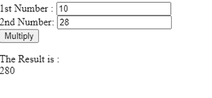
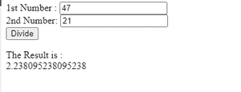

# 如何用 JavaScript 计算两个数的乘除？

> 原文:[https://www . geeksforgeeks . org/如何使用 javascript 计算两个数的乘法和除法/](https://www.geeksforgeeks.org/how-to-calculate-multiplication-and-division-of-two-numbers-using-javascript/)

算术运算对两个数字进行运算，数字称为操作数。

**乘法**乘法运算符(*)将两个或多个数字相乘。

**示例:**

```
var a =1 5;
var b = 12;
var c = a × b;

```

**方法:**创建 [html](https://www.geeksforgeeks.org/html-design-form/) 表单，接受用户输入进行乘法运算。在 html 中添加 [javascript](https://www.geeksforgeeks.org/javascript-tutorial/) 代码来执行乘法逻辑。Document.getElementById(id)。value 属性返回文本字段的 value 属性值。

下面是上述方法的实现:

## 超文本标记语言

```
<!DOCTYPE html>
<html>

<head>
  <style type="text/css">
    body {
      margin: 30px;
    }
  </style>
</head>

<body>
  <form>
    1st Number : <input type="text" 
    id="firstNumber" /><br>
    2nd Number: <input type="text" 
    id="secondNumber" /><br>
    <input type="button" onClick="multiplyBy()" 
    Value="Multiply" /><br>
  </form>

  <p>The Result is : <br>
   <span id = "result"></span>
  </p>

  <script>
    function multiplyBy()
    {
      num1 = document.getElementById(
        "firstNumber").value;
      num2 = document.getElementById(
        "secondNumber").value;
      document.getElementById(
        "result").innerHTML = num1 * num2;
    }
  </script>
</body>

</html>
```

**输出:**



2 的乘法

**除法**除法运算符(/)将两个或多个数字相除。

**示例:**

```
var a = 50;
var b = 20;
var c = a / b;

```

**方法:**创建 html 表单，接受用户输入，进行除法运算。在 html 中添加 JavaScript 代码来执行除法逻辑。Document.getElementById(id)。value 属性返回文本字段的 value 属性值。

下面是上述方法的实现:

## 超文本标记语言

```
<!DOCTYPE html>
<html>

<head>
  <style type="text/css">
    body {
      margin: 30px;
    }
  </style>
</head>

<body>
  <form>
    1st Number : <input type="text"
    id="firstNumber" /><br>
    2nd Number: <input type="text" 
    id="secondNumber" /><br>
    <input type="button" onClick="divideBy()" 
     Value="Divide" />
  </form>

  <p>The Result is : <br>
    <span id = "result"></span>
  </p>

  <script>
    function divideBy() 
    { 
      num1 = document.getElementById(
        "firstNumber").value;
      num2 = document.getElementById(
        "secondNumber").value;
      document.getElementById(
        "result").innerHTML = num1 / num2;
    }
  </script>
</body>

</html>
```

**输出:**



2 的除法