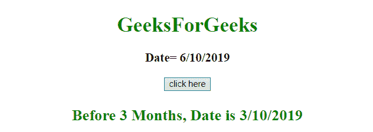
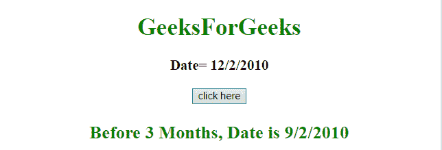

# 如何用 JavaScript 计算三个月前的日期？

> 原文:[https://www . geesforgeks . org/如何使用 javascript 计算三个月前的日期/](https://www.geeksforgeeks.org/how-to-calculate-the-date-three-months-prior-using-javascript/)

给定一个日期，任务是使用 javascript 获取三个月前的日期。

**进场:**

*   首先选择日期对象。
*   然后使用 getMonth()方法获取月份。
*   然后用 getMonth()方法减去三个月，返回日期。

**例 1:** 本例使用 **getMonth()和 setMonth()** 方法获取并设置月份日期。

```
<!DOCTYPE HTML> 
<html> 
    <head> 
        <title> 
            How to calculate the date
            three months prior to today
        </title>
    </head> 

    <body style = "text-align:center;"> 

        <h1 style = "color:green;" > 
            GeeksForGeeks 
        </h1>

        <p id = "GFG_UP" style =
            "font-size: 19px; font-weight: bold;">
        </p>

        <button onClick = "GFG_Fun()">
            click here
        </button>

        <p id = "GFG_DOWN" style =
            "color: green; font-size: 24px; font-weight: bold;">
        </p>

        <script>
            var up = document.getElementById('GFG_UP');
            var down = document.getElementById('GFG_DOWN');
            var d = new Date();

            up.innerHTML = "Today's Date= "+ d.toLocaleDateString();

            function GFG_Fun() {
                d.setMonth(d.getMonth() - 3);
                down.innerHTML = "Before 3 Months, Date is "
                        + d.toLocaleDateString();
            }
        </script> 
    </body> 
</html>                    
```

**输出:**

*   **点击按钮前:**
    
*   **点击按钮后:**
    

**例 2:** 本例使用 **getMonth()和 setMonth()** 方法获取并设置提供的月份日期。

```
<!DOCTYPE HTML> 
<html> 
    <head> 
        <title> 
            How to calculate the date
            three months prior to today
        </title>
    </head> 

    <body style = "text-align:center;"> 

        <h1 style = "color:green;" > 
            GeeksForGeeks 
        </h1>

        <p id = "GFG_UP" style =
            "font-size: 19px; font-weight: bold;">
        </p>

        <button onClick = "GFG_Fun()">
            click here
        </button>

        <p id = "GFG_DOWN" style =
            "color: green; font-size: 24px; font-weight: bold;">
        </p>

        <script>
            var up = document.getElementById('GFG_UP');
            var down = document.getElementById('GFG_DOWN');
            var d = new Date("2010/12/02");

            up.innerHTML = "Date= "+ d.toLocaleDateString();

            function GFG_Fun() {
                d.setMonth(d.getMonth() - 3);
                down.innerHTML = "Before 3 Months, Date is "
                        + d.toLocaleDateString();
            }
        </script> 
    </body> 
</html>                    
```

**输出:**

*   **点击按钮前:**
    
*   **点击按钮后:**
    