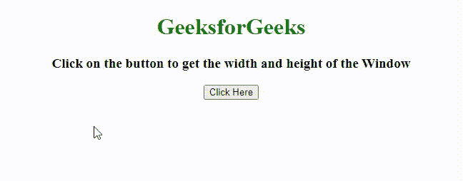
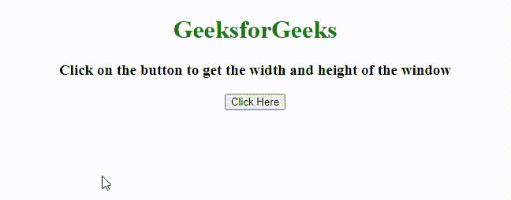

# 如何用 JavaScript 计算窗口的宽度和高度？

> 原文:[https://www . geesforgeks . org/如何使用 javascript 计算窗户的宽度和高度/](https://www.geeksforgeeks.org/how-to-calculate-width-and-height-of-the-window-using-javascript/)

在本文中，我们将知道如何使用 Javascript 计算窗口的宽度和高度。给定一个运行在窗口上的 HTML 文档&我们需要找到窗口的高度和宽度。 [**窗口内部宽度属性**](https://www.geeksforgeeks.org/html-window-innerwidth-property/) 用于返回窗口内容区域的宽度。 [**窗口内部高度属性**](https://www.geeksforgeeks.org/html-window-innerheight-property/) 用于返回窗口内容区域的高度。这两个属性都是只读属性。

**语法:**

```
window.innerWidth
window.innerHeight
```

**返回值:**返回代表窗口内容区域宽度&内高(以像素为单位)的数字。

**示例 1:** 本示例使用 **window.innerHeight** 和 **window.innerWidth** 属性获取窗口的高度和宽度。 **innerHeight 属性**用于返回窗口的高度， **innerWidth 属性**用于返回窗口的宽度。

## 超文本标记语言

```
<!DOCTYPE HTML>
<html>

<head>
    <title>Calculate Width and Height of the Window</title>
</head>

<body style="text-align:center;">
    <h1 style="color:green;">
            GeeksforGeeks
        </h1>
    <p id="GFG_UP" style="font-size: 19px; font-weight: bold;"></p>

    <button onclick="GFG_Fun()">Click Here</button>
    <p id="GFG_DOWN"
       style="color: green;
              font-size: 24px;
              font-weight: bold;">
    </p>

    <!-- Script to display the window width and height -->
    <script>
    var el_up = document.getElementById("GFG_UP");
    var el_down = document.getElementById("GFG_DOWN");
    el_up.innerHTML = "Click on the button to get the"
    + " width and height of the Window";

    function GFG_Fun() {
        var width = window.innerWidth;
        var Height = window.innerHeight;
        el_down.innerHTML = "Width: " + width + " pixels"
        + ", " + "Height: " + Height + " pixels";
    }
    </script>
</body>

</html>
```

**输出:**



窗口.内部属性

**示例 2:** 本示例使用**document . document element . client Height**和**document . document element . client Width**方法分别获取窗口的高度和宽度。

## 超文本标记语言

```
<!DOCTYPE HTML>
<html>

<head>
    <title>Calculate Width and Height of the Window</title>
</head>

<body style="text-align:center;">
    <h1 style="color:green;">
            GeeksforGeeks
        </h1>
    <p id="GFG_UP" style="font-size: 19px; font-weight: bold;"></p>

    <button onclick="GFG_Fun()">Click Here</button>
    <p id="GFG_DOWN"
       style="color: green;
              font-size: 24px;
              font-weight: bold;">
    </p>

    <!-- Script to display the device screen width -->
    <script>
    var el_up = document.getElementById("GFG_UP");
    var el_down = document.getElementById("GFG_DOWN");
    el_up.innerHTML = "Click on the button to get the"
    + " width and height of the window";

    function GFG_Fun() {
        el_down.innerHTML = "Width:"
        + document.documentElement.clientWidth
        + " pixels"
        + ", "
        + "Height:"
        + document.documentElement.clientHeight
        + " pixels";
    }
    </script>
</body>

</html>
```

**输出:**



文档元素.客户端方法