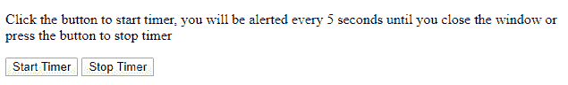
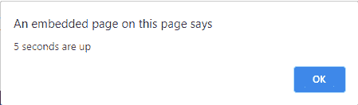

# 如何在 JavaScript 中每 5 秒重复调用一个函数？

> 原文:[https://www . geesforgeks . org/如何在 javascript 中每 5 秒重复调用一个函数/](https://www.geeksforgeeks.org/how-to-call-a-function-repeatedly-every-5-seconds-in-javascript/)

JavaScript 中的 setInterval()方法可用于执行表达式的定期求值或调用 JavaScript 函数。
**语法:**

```
setInterval(function, milliseconds, param1, param2, ...)
```

**参数:**该功能接受以下参数:

*   **函数:**此参数保存要定期调用的函数名。
*   **毫秒:**该参数保存 setInterval()调用/执行上述*函数*的周期，单位为毫秒。
*   **参数 1，参数 2，… :** 一些附加参数将作为输入参数传递给*功能*。

**返回值:**该方法返回表示该方法设置的定时器的 ID。通过调用 clearInterval()方法并将此 ID 作为参数传递给计时器，可以使用此 ID 来清除/取消计时器设置。
**示例:**假设我们想要创建一个提醒计时器，该计时器每 5 秒关闭一次，并通过一个 JavaScript 警告框发出警告。

## java 描述语言

```
<!DOCTYPE html>
<html>

<head>
    <title>
        How to call a function
        repeatedly every 5
        seconds in JavaScript ?
    </title>
</head>

<body>

<p>
        Click the button to start
        timer, you will be alerted
        every 5 seconds until you
        close the window or press
        the button to stop timer
    </p>

    <button onclick="startTimer()">
        Start Timer
    </button>

    <button onclick="stopTimer()">
        Stop Timer
    </button>

    <script>
        var timer;

        function startTimer() {
            timer = setInterval(function() {
                alert("5 seconds are up");
            }, 5000);
        }

        function stopTimer() {
            alert("Timer stopped");
            clearInterval(timer);
        }
    </script>
</body>

</html>
```

**输出:**

*   **点击按钮前:**



*   **点击按钮后:**



在上面的例子中， *setInterval()方法*重复计算表达式/调用函数。清除/取消*设置间隔()方法*设置的定时器的方法是使用*清除间隔()方法*，并将其传递给调用*设置间隔()*时返回的标识/值。