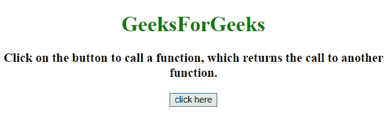
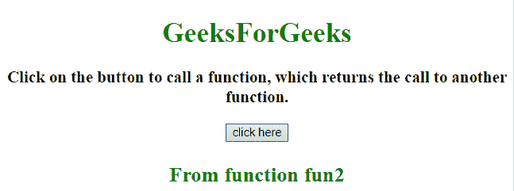
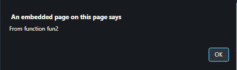
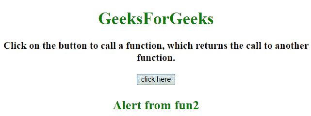

# 如何在 JavaScript 中调用返回另一个函数的函数？

> 原文:[https://www . geeksforgeeks . org/如何调用一个在 javascript 中返回另一个函数的函数/](https://www.geeksforgeeks.org/how-to-call-a-function-that-return-another-function-in-javascript/)

任务是调用一个函数，这个函数在 JavaScript 的帮助下返回另一个函数。我们将讨论一些技巧。

**进场:**

*   首先调用第一个**功能-1** 。
*   在功能-1 中定义一个**功能-2** 。
*   从**功能-1** 返回对**功能-2** 的调用。

**例 1:** 在本例中，**从 **fun2** 返回【功能 2】**，最终由 **fun1** 返回。

```
<!DOCTYPE HTML>
<html>

<head>
    <title>
        JavaScript 
      | Function that return a function.
    </title>
</head>

<body style="text-align:center;"
      id="body">
    <h1 style="color:green;">  
            GeeksForGeeks
        </h1>
    <p id="GFG_UP" 
       style="font-size: 19px;
              font-weight: bold;">
    </p>
    <button onclick="GFG_Fun()">
        click here
    </button>
    <p id="GFG_DOWN"
       style="color: green; 
              font-size: 24px;
              font-weight: bold;">
    </p>
    <script>
        var el_up = document.getElementById("GFG_UP");
        var el_down = document.getElementById("GFG_DOWN");
        el_up.innerHTML = 
          "Click on the button to call a function, "+
          "which returns the call to another function.";

        function fun1() {
            function fun2() {
                return "From function fun2";
            }
            return fun2();
        }

        function GFG_Fun() {
            el_down.innerHTML = fun1();
        }
    </script>
</body>

</html>
```

**输出:**

*   **点击按钮前:**
    
*   **点击按钮后:**
    

**示例 2:** 在本例中，**“来自 fun2 的警报”**与警报一起从 **fun2** 返回，返回值最终由 **fun1** 返回。

```
<!DOCTYPE HTML>
<html>

<head>
    <title>
        JavaScript 
      | Function that return a function.
    </title>
</head>

<body style="text-align:center;"
      id="body">
    <h1 style="color:green;">  
            GeeksForGeeks
        </h1>
    <p id="GFG_UP"
       style="font-size: 19px;
              font-weight: bold;">
    </p>
    <button onclick="GFG_Fun()">
        click here
    </button>
    <p id="GFG_DOWN" 
       style="color: green; 
              font-size: 24px; 
              font-weight: bold;">
    </p>
    <script>
        var el_up = document.getElementById("GFG_UP");
        var el_down = document.getElementById("GFG_DOWN");
        el_up.innerHTML = 
          "Click on the button to call a function, "+
          "which returns the call to another function.";

        function fun1() {
            function fun2() {
                alert("From function fun2");
                return "Alert from fun2 ";
            }
            return fun2();
        }

        function GFG_Fun() {
            el_down.innerHTML = fun1();
        }
    </script>
</body>

</html>
```

**输出:**

*   **点击按钮前:**
    
*   **点击按钮后:**
    
    