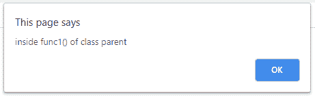
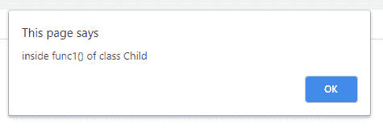
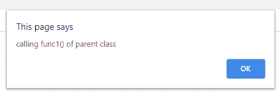
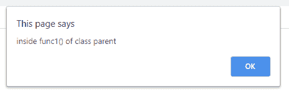
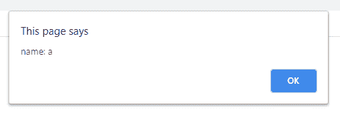
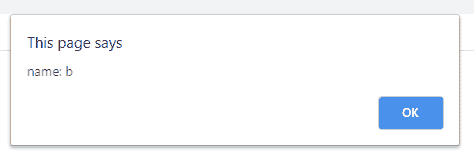
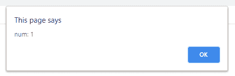

# 如何在 JavaScript 中从子类调用父方法？

> 原文:[https://www . geesforgeks . org/如何从 javascript 中的子类调用父方法/](https://www.geeksforgeeks.org/how-to-call-a-parent-method-from-child-class-in-javascript/)

编程中称为**继承**的一种属性，通过这种属性，一个类可以导出其他类的方法和属性，类似于生物中的父子关系。一个孩子从父母那里继承了自己的特点，但在另一边却行不通。同样，类似于生物的亲子关系，一个孩子除了继承的属性之外，也可以有自己的属性。在编程上下文中，从其他类派生的类称为派生类、子类或子类。而从中派生特征的类被称为基类、超类或父类。

继承、子类和超类的概念在所有编程语言中都是相同的，唯一的区别是它们的实现。这里的目标是在子类的帮助下调用父类中定义的函数。为了获得这个结果，可以使用下列方法。

**直接调用** **方法:**由于派生类可以访问其基类的所有特性，所以使用子类的对象来引用父类的函数是完全有意义的。

## java 描述语言

```
<!DOCTYPE html>
<html>
    <head>
        <title>Calling parrent from child class</title>
    </head>
    <body>
        <script type="text/javascript">
            class Parent {
                func1() {
                    alert("inside func1() of class parent");
                }

                func2() {
                    alert("inside func2() of class parent");
                }
            }

            class Child extends Parent {
                func3() {
                    alert("inside func3() of class Child");
                }
            }

            // Declaring objects
            // Parent's object
            let p1 = new Parent();

            // Child's object
            let c1 = new Child();

            // Calling func()1 using parent's object
            p1.func1();

            // Calling func1() using child's object
            c1.func1();
        </script>
    </body>
</html>
```

**输出:**两次会弹出该提醒，一次使用父对象，另一次使用子对象。



**使用超级方法:**JS 中使用超级关键字从父类调用函数和构造函数。在子类中提到 super 时，编译器会在其父类中查找指定的函数。这主要用于函数重载和某个需求要求函数的父版本时。它也用于重载构造函数

## java 描述语言

```
<!DOCTYPE html>
<html>
    <head>
        <title>Calling parrent from child class</title>
    </head>

    <body>
        <script type="text/javascript">
            class Parent {
                func1() {
                    alert("inside func1() of class parent");
                }

                func2() {
                    alert("inside func2() of class parent");
                }
            }

            class Child extends Parent {
                // Overloaded function
                func1() {
                    alert("inside func1() of class Child ");
                    alert("calling func1() of parent class");

                    // Calling for parent's version of func1()
                    super.func1();
                }
            }

            let c1 = new Child();

            // Call to func1() of child class
            // There the func1() will call func1() 
            // From aprent using super
            c1.func1();
        </script>
    </body>
</html>
```

**输出:**

  

**调用方法&构造函数:**在这个程序中，我们从子类中调用方法和构造函数。

## java 描述语言

```
<!DOCTYPE html>
<html>
    <head>
        <title>
         Call method and constructor from child class
        </title>
    </head>

    <body>
        <script type="text/javascript">
            class Parent {
                constructor(name) {
                    this.name = name;
                }

                display() {
                    alert("name: " + this.name);
                }
            }

            class Child extends Parent {
                constructor(name, num) {

                    // Calling parent's constructor
                    super(name);
                    this.num = num;
                }

                display() {

                    // Calling display() from parent
                    super.display();
                    alert("num: " + this.num);
                }
            }

            let p1 = new Parent("a");
            let c1 = new Child("b", 1);
            p1.display();
            c1.display();
        </script>
    </body>
</html>
```

**输出:**

  