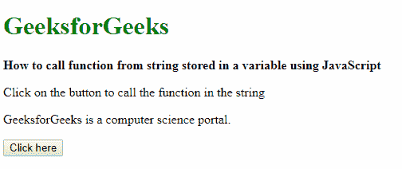
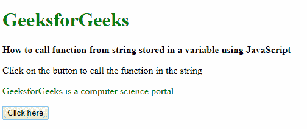

# 如何使用 JavaScript 从存储在字符串中的函数名调用函数？

> 原文:[https://www . geesforgeks . org/如何使用 javascript 从字符串中调用函数名称/](https://www.geeksforgeeks.org/how-to-call-function-from-it-name-stored-in-a-string-using-javascript/)

有两种方法可以从存储在变量中的字符串调用函数。第一种是使用 window 对象方法，第二种是使用 eval()方法。eval()方法较旧，不推荐使用。

**方法 1:使用窗口对象:**HTML 5 中的窗口对象引用当前窗口以及其中包含的所有项目。因此，我们可以使用它来运行字符串中的函数以及函数的参数。

**语法:**

```
window[functionName](parameters)
```

**示例:**

```
<!DOCTYPE html>
<html>

<head>
    <title>
        How to call function from string stored
        in a variable using JavaScript
    </title>
</head>

<body>
    <h1 style="color: green">
        GeeksforGeeks
    </h1>

    <b>
        How to call function from string stored
        in a variable using JavaScript 
    </b>

    <p>
        Click on the button to call the
        function in the string
    </p>

    <p class="example">
        GeeksforGeeks is a computer
        science portal.
    </p>

    <button onclick="evaluateFunction()">
        Click here
    </button>

    <script type="text/javascript">

        function changeColor(color) {
            document.querySelector('.example').style
                = `color: ${color}`;
        }

        function evaluateFunction() {
            stringFunction = "changeColor";
            param = 'green';
            window[stringFunction](param);
        }
    </script>
</body>

</html>                    
```

**输出:**

*   **点击按钮前:**
    
*   **点击按钮后:**
    

**方法 2:使用 eval()方法:**可以使用的另一种方法是 eval()方法。可以传递给函数的字符串可以包括 JavaScript 表达式、语句或语句序列。它也可以有现有对象的变量和属性。这种方法的唯一问题是它被认为是不安全的，并且可能不被更新的浏览器所支持。

**语法:**

```
eval(stringFunction)
```

**示例:**

```
<!DOCTYPE html>
<html>

<head>
    <title>
        How to call function from string stored
        in a variable using JavaScript
    </title>
</head>

<body>
    <h1 style="color: green">
        GeeksforGeeks
    </h1>

    <b>
        How to call function from string stored
        in a variable using JavaScript 
    </b>

    <p>
        Click on the button to call the
        function in the string
    </p>

    <p class="example">
        GeeksforGeeks is a computer
        science portal.
    </p>

    <button onclick="evaluateFunction()">
        Click here
    </button>

    <script type="text/javascript">

        function changeColor(color) {
            document.querySelector('.example').style
                    = `color: ${color}`;
        }

        function evaluateFunction() {
            stringFunction = "changeColor('green')";
            eval(stringFunction);
        }
    </script>
</body>

</html>                    
```

**输出:**

*   **点击按钮前:**
    
*   **点击按钮后:**
    