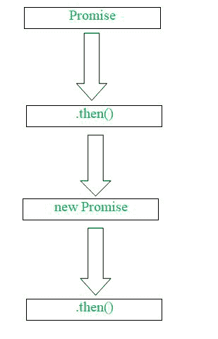

# 如何在 JavaScript 中调用另一个诺言里面的诺言？

> 原文:[https://www . geeksforgeeks . org/如何调用另一个 javascript 中的承诺内的承诺/](https://www.geeksforgeeks.org/how-to-call-promise-inside-another-promise-in-javascript/)

在本文中，我们将学习如何在 JavaScript 中的另一个承诺中调用承诺。

**问题陈述:**您需要首先使用 JavaScript 中的基本语法声明一个承诺，并进一步执行预声明的承诺，您需要创建另一个承诺，该承诺将在之前的承诺内部调用以执行。

在用图形方式分析问题陈述之前，让我们先了解什么是承诺，以及如何在 JavaScript 中声明承诺。

Promise 基本上是一个 JavaScript 对象，负责处理所有的异步操作或活动，比如从 API 获取数据等等。

Promise 在一个函数(或回调函数)内部接受两个参数，为了结果执行，在函数内部传递这两个参数:第一个参数被解析，这最终意味着您的结果稍后将被成功显示，而另一个参数被拒绝，这意味着您的数据在执行时不会被成功显示。

**示例:**以下语法将用于在 JavaScript 中声明和执行承诺。

## java 描述语言

```
<script>
let promise = new Promise((resolve, reject)=>{
    resolve('GeeksforGeeks');
})
.then((result)=>{
    console.log(result);
})
</script>
```

**输出:**

```
GeeksforGeeks
```

现在，在分析了关于 Promise 的事实之后，让我们借助下面的图片来理解问题陈述。



作为一个例子，让我们理解上面举例说明的场景。在这里，我们需要首先使用 promise 语法声明一个 Promise，我们将使用 then()方法来执行它，然后在 then()方法中，我们将使用与上面所示相同的 Promise 语法创建另一个 Promise，然后我们将在新 Promise 中调用我们的 first 结果。

现在，在分析了与我们的问题陈述相关的上述事实之后，让我们看看以下方法，以更有效地理解和分析我们的问题陈述。

**方法 1:**

*   这基本上是一种原生的简单方法，首先我们可以使用上面说明的 promise 语法来声明 promise。
*   然后，我们可以声明我们当时的()方法来处理这个承诺创建的结果。
*   然后()方法之后，我们将使用相同的 promise 语法声明另一个 Promise。
*   然后我们将第一个承诺的结果称为第二个承诺，为了更好地理解，我们将使用第一个承诺的结果和第二个承诺的结果来看看这个过程是如何进行的。

**示例:**

```
<script>
let firstPromise = new Promise((resolve, reject) => {
    resolve("Hello, ");
})
    .then((result) => {
        console.log(result);
        return new Promise((resolve, reject) => {
            resolve(result + "GeeksforGeeks!");
        })
            .then((result) => {
                console.log(result);
            });
    });
</script>
```

**输出:**

```
Hello
Hello GeeksforGeeks!
```

**方法 2:**

*   在这种方法中，我们将考虑 setTimeout()方法，以便更好地理解 promise 调用过程是如何工作的。
*   如方法 1 所示，首先声明一个新的承诺，然后用 setTimeout()方法包装您的结果，并提供 1000 毫秒的时间延迟(大约等于 1 秒)。
*   然后在使用 Then()方法执行结果后，声明另一个承诺，并在第二个承诺中首先打印第一个承诺的结果。
*   然后在第一个承诺的结果之后，也用 setTimeout()方法包装第二个承诺的结果，并提供 2000 毫秒的时间延迟(大约等于 2 秒)。
*   然后使用 Then()方法在控制台中输出第二个参数的结果。

**示例:**

## java 描述语言

```
<script>
let firstPromise = new Promise((resolve, reject) => {
    setTimeout(() => {
        resolve("Hello ");
    }, 1000);
})
    .then((result) => {
        console.log(result);
        return new Promise((resolve, reject) => {
            setTimeout(() => {
                resolve(result + "GeeksforGeeks!");
            }, 2000);
        })
            .then((result) => {
                console.log(result);
            });
    });
</script>
```

**输出:**

```
// After 1 second......
Hello 

// After 2 seconds.....
Hello GeeksforGeeks!  
```