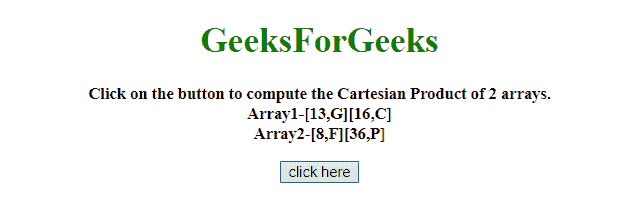
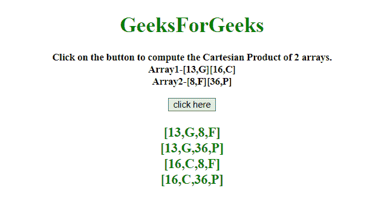

# 如何用 JavaScript 实现 2 个数组的笛卡尔乘积？

> 原文:[https://www . geeksforgeeks . org/如何使用-javascript/](https://www.geeksforgeeks.org/how-to-cartesian-product-of-2-arrays-using-javascript/) 生成 2 的笛卡尔乘积数组

任务是在 JavaScript 的帮助下计算 2 个 JavaScript 数组的笛卡尔乘积。这里讨论一些技巧。
**进场 1:**

*   创建一个新数组。
*   通过外环遍历第一个数组，通过内环遍历第二个数组。
*   在内部循环中，将第一个数组元素与第二个数组元素连接起来，并将其推入新数组中。

**示例 1:** 该示例使用如上所述的方法。

```
<!DOCTYPE HTML>
<html>

<head>
    <title>
        cartesian product of 2 arrays using JavaScript
    </title>
</head>

<body style="text-align:center;" 
      id="body">
    <h1 style="color:green;" 
        id="h1">  
            GeeksForGeeks  
        </h1>
    <p id="GFG_UP" 
       style="font-size: 15px; 
              font-weight: bold;">
    </p>
    <button onclick="GFG_Fun()">
        click here
    </button>
    <p id="GFG_DOWN" 
       style="color:green;
              font-size: 20px;
              font-weight: bold;">
    </p>
    <script>
        var up = document.getElementById('GFG_UP');
        var down = document.getElementById('GFG_DOWN');
        var arr1 = [
            [13, 'G'],
            [16, 'C']
        ];
        var arr2 = [
            [8, 'F'],
            [36, 'P']
        ];
        up.innerHTML = "Click on the button to compute the "+
          "Cartesian Product of 2 arrays.<br>Array1-";
        var res = "";
        for (var i = 0; i < arr1.length; i++) {
            res = res + "[" + arr1[i] + "]";
        }
        up.innerHTML = up.innerHTML + res + "<br>Array2-";
        res = "";
        for (var i = 0; i < arr2.length; i++) {
            res = res + "[" + arr2[i] + "]";
        }
        up.innerHTML = up.innerHTML + res;

        function GFG_Fun() {
            var ans = [];
            for (var i = 0; i < arr1.length; i++) {
                for (var l = 0; l < arr2.length; l++) {
                    ans.push(arr1[i].concat(arr2[l]));
                }
            }
            res = "";
            for (var i = 0; i < ans.length; i++) {
                res = res + "[" + ans[i] + "]<br>";
            }
            down.innerHTML = res;
        }
    </script>
</body>

</html>
```

**输出:**

*   **点击按钮前:**
    
*   **点击按钮后:**
    

**方法 2:**

*   创建一个新数组。
*   这里遵循同样的方法，对于第一个数组的每个元素，第二个数组的每个元素在**的帮助下被连接并推到新数组。应用()和。地图()方法**。

**示例 2:** 该示例使用如上所述的方法。

```
<!DOCTYPE HTML>
<html>

<head>
    <title>
        cartesian product of 2 arrays using JavaScript
    </title>
</head>

<body style="text-align:center;" id="body">
    <h1 style="color:green;" id="h1">  
            GeeksForGeeks  
        </h1>
    <p id="GFG_UP" 
       style="font-size: 15px;
              font-weight: bold;">
    </p>
    <button onclick="GFG_Fun()">
        click here
    </button>
    <p id="GFG_DOWN" 
       style="color:green; 
              font-size: 20px; 
              font-weight: bold;">
    </p>
    <script>
        var up = document.getElementById('GFG_UP');
        var down = document.getElementById('GFG_DOWN');
        var arr1 = [
            [13, 'G'],
            [16, 'C']
        ];
        var arr2 = [
            [8, 'F'],
            [36, 'P']
        ];
        up.innerHTML = "Click on the button to compute"+
          " the Cartesian Product of 2 arrays.<br>Array1-";
        var res = "";
        for (var i = 0; i < arr1.length; i++) {
            res = res + "[" + arr1[i] + "]";
        }
        up.innerHTML = up.innerHTML + res + "<br>Array2-";
        res = "";
        for (var i = 0; i < arr2.length; i++) {
            res = res + "[" + arr2[i] + "]";
        }
        up.innerHTML = up.innerHTML + res;

        function GFG_Fun() {
            var ans = [].concat.apply([], arr1.map(
              arr1 => (arr2.map(arr2 => arr1.concat(arr2)))));

            res = "";
            for (var i = 0; i < ans.length; i++) {
                res = res + "[" + ans[i] + "]<br>";
            }
            down.innerHTML = res;
        }
    </script>
</body>

</html>
```

**输出:**

*   **点击按钮前:**
    
*   **点击按钮后:**
    