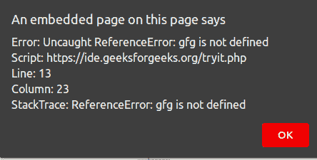

# 如何捕捉所有 JavaScript 错误并发送到服务器？

> 原文:[https://www . geesforgeks . org/how-to-catch-all-JavaScript-errors-and-send-to-server/](https://www.geeksforgeeks.org/how-to-catch-all-javascript-errors-and-send-them-to-server/)

今天有大量的网络应用编程接口可用。其中一个是**全局事件处理程序**，当出现错误时将调用一个**onerreventhandler**。

**全局事件处理程序**的**one error**属性是处理错误事件的**事件处理程序**。这对于捕捉测试时从未发生的异常非常有用。不同的错误事件有:

*   发生 JavaScript 运行时错误时，调用 **window.onerror()** 。
*   当资源加载失败时，调用元素上的 **onerror()** 处理程序。这些错误事件可以通过**窗口来处理。添加事件侦听器**配置为**使用捕获**设置为真。

所有的 JavaScript 错误都可以被这个浏览器事件**捕捉到。这是记录客户端错误并将其报告给服务器的最简单方法之一。一个功能被分配给**窗口。一个错误**如下:**

**语法:**

```
window.onerror = function (msg, source, lineNo, columnNo, error) {
   // function to execute error handling
}
```

以下参数被传递给分配给**窗口的函数。**

1.  **消息:**与错误相关的消息。
2.  **来源:**与错误相关的脚本或文档的 URL。
3.  **行号:**行号。
4.  **列号:**列号。
5.  **错误:**与此错误相关的错误对象。

如果返回值为真，则只处理错误。

**示例:**

*   **捕捉错误:**通过使用下面的代码，我们可以捕捉所有的错误。

## 超文本标记语言

```
<!DOCTYPE html>
<html>
    <head>
        <title>
            Catch all JavaScript errors 
            and send them to server
        </title>
    </head>
    <body>
        <center>
        <h1 style="color: green;">
            GeeksforGeeks
        </h1>
        <b>
            Catch all JavaScript errors 
            and send them to server
        </b>
        <a href="javascript:myalert()">click here</a>

        <script>
            window.onerror = 
              function (msg, source, lineNo, columnNo, error) {
                alert("Error: " + msg + 
                      "\nScript: " + source + 
                      "\nLine: " + lineNo + 
                      "\nColumn: " + columnNo + 
                      "\nStackTrace: " + error);
                return true;
            };

            var myalert = function () {
                alert(gfg);
            };
        </script>
        </center>
    </body>
</html>
```

**输出:**



*   **在服务器上发送错误:**插入**窗口后，为了捕捉尽可能多的错误信息，只剩下最后一步，即将错误信息传输到您的服务器。在下面的例子中，我们使用 **jQuery 的 AJAX 函数**将数据传输到服务器:**

## java 描述语言

```
function captureError(err) {
  var errorData = {
    name: err.name, 
    message: err.line, 
    url: document.location.href,
    stack: err.stack 
  };
  $.post('/logger/js/', {
    data: errorData
  });
}
```