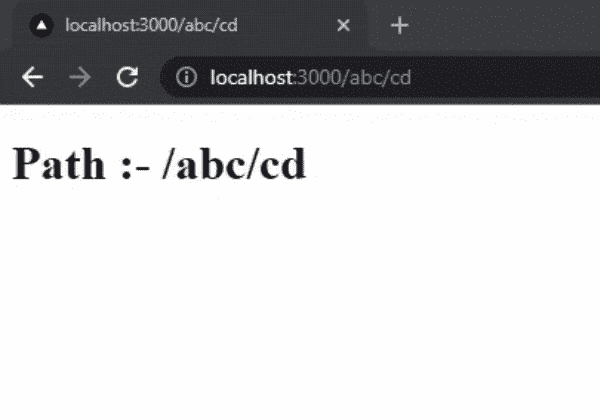

# 如何在 Next.js 中捕捉所有路线？

> 原文:[https://www . geesforgeks . org/how-to-catch-all-routes-in-next-js/](https://www.geeksforgeeks.org/how-to-catch-all-routes-in-next-js/)

在本文中，我们将学习如何在我们的 NextJS 项目中捕捉所有路线。 **NextJS** 是一个基于 React 的框架。它有能力为不同的平台开发漂亮的网络应用程序，如视窗、Linux 和 mac。动态路径的链接有助于有条件地呈现您的 NextJS 组件。**路由**定义了应用程序端点处理客户端请求的方式。

**捕捉所有路线:**我们可以使用捕捉所有路线来捕捉 NextJs 中的所有路径。为此，我们必须在文件名的方括号内添加三个点，如下所示:

```
./pages/[...file_name].js
```

**创建 NextJS 应用程序:**您可以使用以下命令创建一个新的 NextJs 项目:

```
npx create-next-app gfg
```

创建项目文件夹(即 gfg)后，使用以下命令移动到该文件夹。

```
cd gfg
```

**项目结构:**会是这样的。


现在让我们创建一个新的动态路径来捕获所有路径。为此，我们将在 pages 目录中创建一个名为[…gfg].js 的新 javascript 文件。

**文件名:/pages/【gfg】。js〔t1〕**

## java 描述语言

```
// Importing useRouter() method
import { useRouter } from 'next/router'

function Gfg(){

  // Initializing useRouter() method
  const router = useRouter()

  return <h1>Path :- {router.asPath} </h1>
}

export default Gfg;
```

**解释:**在上面的代码中，我们使用 useRouter 钩子来访问路由器对象。Router 对象包含关于当前路由的数据，如路径名、查询、asPath 等。首先，我们在文件中导入 useRouter，然后，我们创建一个新变量来存储路由器对象的值。然后我们显示路由器对象的 asPath 属性值。

**运行应用程序的步骤:**从项目的根目录使用以下命令运行应用程序。

```
npm run dev
```

**输出:**

